Network Analysis
================
2022-11-30

% Web 34 Chesapeake Bay Mesohaline Network; D. Baird; Umcees Ref
No. XXX-86; MGC/M2/SUM 1 % from datall.zip from
<http://www.cbl.cees.edu/~ulan/ntwk/network.html> % Chesapeake Bay
mesohaline ecosystem. Summer carbon flows. % Baird, D. and R.E.
Ulanowicz. 1989. The seasonal dynamics of the % Chesapeake Bay
ecosystem. Ecol. Monogr. 59: 329-364. % transformed from SCOR format by
Scor2net 15.7.2003 \*partition ECO types / chesapeake

``` r
Chesapeake <- read.table("Chesapeake.paj", quote="\"", comment.char="")
nodelist <- read.csv("Chesapeake Nodelist.csv")
```

``` r
library(igraph)
```

    ## 
    ## Attaching package: 'igraph'

    ## The following objects are masked from 'package:stats':
    ## 
    ##     decompose, spectrum

    ## The following object is masked from 'package:base':
    ## 
    ##     union

``` r
library(ggraph)
```

    ## Loading required package: ggplot2

``` r
net <- graph_from_data_frame(Chesapeake, directed = T, vertices = union(unique(Chesapeake$V2), unique(Chesapeake$V1)))
net <- simplify(net, remove.multiple = F, remove.loops = T)
```

``` r
#new_net <- net %>%
 # delete_vertices(c(34, 35, 36, 37, 38, 39)) 
#ggraph(new_net) +
 # geom_edge_link0() +
 # geom_node_point()

#subset(Chesapeake, V1 = "1:33")
#subset(Chesapeake, V2 = 1:33)
#filter(Chesapeake, V1 == 13)
Chesapeake_1 <- Chesapeake[Chesapeake$V1 %in% 1:33, ]    # Subset data frame
Chesapeake_2 <- Chesapeake_1[Chesapeake_1$V2 %in% 1:33, ]
Chesapeake_2
```

    ##     V1 V2           V3
    ## 56   1  7 3.367145e+04
    ## 57   1  8 3.944067e+04
    ## 58   1 11 4.458031e+03
    ## 59   1 12 2.415342e+03
    ## 60   1 13 4.687355e+03
    ## 61   1 22 2.940877e+02
    ## 62   1 23 2.208312e+01
    ## 65   2  7 1.443316e+03
    ## 66   2  8 1.131006e+03
    ## 67   2  9 1.241849e+02
    ## 68   2 11 1.584640e+02
    ## 69   2 12 7.102142e+01
    ## 70   2 13 1.099190e+02
    ## 71   2 22 1.334218e+01
    ## 72   2 23 5.131606e+00
    ## 75   3 14 1.348963e+05
    ## 76   3 15 2.102110e+04
    ## 77   3 16 4.808909e+04
    ## 78   3 17 3.016274e+04
    ## 79   3 18 1.180524e+04
    ## 81   4 17 1.808600e+04
    ## 83   5  6 9.101112e+04
    ## 85   6  7 3.245466e+04
    ## 87   7  8 7.850837e+03
    ## 88   7  9 3.571585e+03
    ## 89   7 11 3.013558e+02
    ## 90   7 12 1.621086e+02
    ## 91   7 13 3.159040e+02
    ## 93   8  9 7.165512e+03
    ## 94   8 10 1.207448e+03
    ## 95   8 20 5.104828e+00
    ## 96   8 21 2.677430e+01
    ## 97   8 22 1.598124e+03
    ## 98   8 23 2.585752e+02
    ## 99   8 24 5.417368e+00
    ## 101  9 10 5.725732e+02
    ## 106 11 19 5.561747e+02
    ## 108 12 19 2.251819e+02
    ## 109 12 26 9.426217e+00
    ## 112 14 25 6.004372e+00
    ## 113 14 26 4.920249e+01
    ## 114 14 27 2.618573e+02
    ## 115 14 28 6.337948e+01
    ## 116 14 29 1.274261e+02
    ## 118 15 19 2.935468e+02
    ## 119 15 25 1.751274e+00
    ## 120 15 26 1.167516e+01
    ## 121 15 27 8.089216e+01
    ## 122 15 28 4.920245e+01
    ## 123 15 29 1.884704e+01
    ## 125 16 19 3.784450e+03
    ## 126 16 27 4.586706e+01
    ## 129 18 19 8.064227e+02
    ## 130 18 25 2.501829e-01
    ## 131 18 26 1.167520e+01
    ## 132 18 27 1.667886e+00
    ## 133 18 29 3.594294e+01
    ## 134 18 32 7.505485e-01
    ## 136 19 19 2.497562e+02
    ## 137 19 33 2.045784e+00
    ## 140 21 33 2.083602e-01
    ## 142 22 27 1.510978e+01
    ## 143 22 28 1.521399e+01
    ## 144 22 30 2.813546e+00
    ## 145 22 31 9.524374e+01
    ## 146 22 32 1.281727e+01
    ## 147 22 33 1.792333e+01
    ## 149 23 30 2.699752e+00
    ## 150 23 32 8.306931e+00
    ## 151 23 33 1.100668e+01
    ## 156 27 30 8.570167e+00
    ## 161 31 32 4.480828e+00

``` r
ggraph(Chesapeake_2) +
  geom_edge_link(color = "black", alpha = 0.3) +
  geom_node_point(color = "blue") +
  theme_graph()
```

    ## Using "stress" as default layout

    ## Warning: Using the `size` aesthetic in this geom was deprecated in ggplot2 3.4.0.
    ## ℹ Please use `linewidth` in the `default_aes` field and elsewhere instead.
    ## This warning is displayed once every 8 hours.
    ## Call `lifecycle::last_lifecycle_warnings()` to see where this warning was
    ## generated.

<!-- -->

``` r
#Chesapeake_no_blue_crab <- Chesapeake_2[Chesapeake_2$V1 %in% 1:18 | 20:33, ]
#Chesapeake_no_blue_crab_final <- Chesapeake_no_blue_crab[Chesapeake_no_blue_crab$V1 %in% 1:18 | 20:33, ]
#Chesapeake_no_blue_crab_final

Chesapeake_nbc <- subset(Chesapeake_2, V1 != 19)
Chesapeake_nbc <- subset(Chesapeake_2, V2 != 19)
Chesapeake_nbc
```

    ##     V1 V2           V3
    ## 56   1  7 3.367145e+04
    ## 57   1  8 3.944067e+04
    ## 58   1 11 4.458031e+03
    ## 59   1 12 2.415342e+03
    ## 60   1 13 4.687355e+03
    ## 61   1 22 2.940877e+02
    ## 62   1 23 2.208312e+01
    ## 65   2  7 1.443316e+03
    ## 66   2  8 1.131006e+03
    ## 67   2  9 1.241849e+02
    ## 68   2 11 1.584640e+02
    ## 69   2 12 7.102142e+01
    ## 70   2 13 1.099190e+02
    ## 71   2 22 1.334218e+01
    ## 72   2 23 5.131606e+00
    ## 75   3 14 1.348963e+05
    ## 76   3 15 2.102110e+04
    ## 77   3 16 4.808909e+04
    ## 78   3 17 3.016274e+04
    ## 79   3 18 1.180524e+04
    ## 81   4 17 1.808600e+04
    ## 83   5  6 9.101112e+04
    ## 85   6  7 3.245466e+04
    ## 87   7  8 7.850837e+03
    ## 88   7  9 3.571585e+03
    ## 89   7 11 3.013558e+02
    ## 90   7 12 1.621086e+02
    ## 91   7 13 3.159040e+02
    ## 93   8  9 7.165512e+03
    ## 94   8 10 1.207448e+03
    ## 95   8 20 5.104828e+00
    ## 96   8 21 2.677430e+01
    ## 97   8 22 1.598124e+03
    ## 98   8 23 2.585752e+02
    ## 99   8 24 5.417368e+00
    ## 101  9 10 5.725732e+02
    ## 109 12 26 9.426217e+00
    ## 112 14 25 6.004372e+00
    ## 113 14 26 4.920249e+01
    ## 114 14 27 2.618573e+02
    ## 115 14 28 6.337948e+01
    ## 116 14 29 1.274261e+02
    ## 119 15 25 1.751274e+00
    ## 120 15 26 1.167516e+01
    ## 121 15 27 8.089216e+01
    ## 122 15 28 4.920245e+01
    ## 123 15 29 1.884704e+01
    ## 126 16 27 4.586706e+01
    ## 130 18 25 2.501829e-01
    ## 131 18 26 1.167520e+01
    ## 132 18 27 1.667886e+00
    ## 133 18 29 3.594294e+01
    ## 134 18 32 7.505485e-01
    ## 137 19 33 2.045784e+00
    ## 140 21 33 2.083602e-01
    ## 142 22 27 1.510978e+01
    ## 143 22 28 1.521399e+01
    ## 144 22 30 2.813546e+00
    ## 145 22 31 9.524374e+01
    ## 146 22 32 1.281727e+01
    ## 147 22 33 1.792333e+01
    ## 149 23 30 2.699752e+00
    ## 150 23 32 8.306931e+00
    ## 151 23 33 1.100668e+01
    ## 156 27 30 8.570167e+00
    ## 161 31 32 4.480828e+00

``` r
net <- graph_from_data_frame(Chesapeake_2, directed = T, vertices = union(unique(Chesapeake_2$V2), unique(Chesapeake_2$V1)))
net <- simplify(net, remove.multiple = F, remove.loops = T)
#GOOD 
ggraph(net) +
  geom_edge_link(color = "black", alpha = 0.3) +
  geom_node_point(color = "blue") +
  theme_graph()
```

    ## Using "sugiyama" as default layout

<!-- -->

``` r
#GOOD WITH DEGREE
ggraph(net) +
  geom_edge_link(color = "black", alpha = 0.3) +
  geom_node_point(color = "blue", size = igraph::degree(net, mode = "all")) +
  theme_graph()
```

    ## Using "sugiyama" as default layout

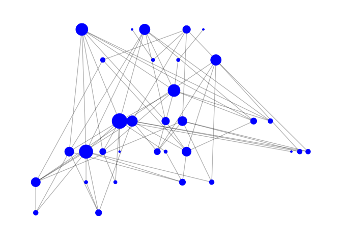<!-- -->

``` r
plot(net, edge.arrow.size=.4, edge.curved=.1) 
```

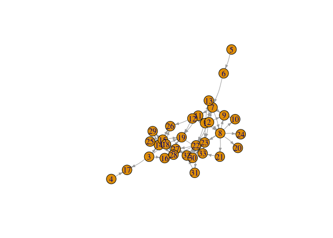<!-- -->

``` r
inc.edges <- incident(net, V(net)["19"], mode="all")
# Set colors to plot the selected edges.
ecol <- rep("gray80", ecount(net))
ecol[inc.edges] <- "orange"
vcol <- rep("grey40", vcount(net))
vcol[V(net)$V1 == "19"] <- "gold"
plot(net, vertex.color=vcol, edge.color=ecol, edge.width=2)
```

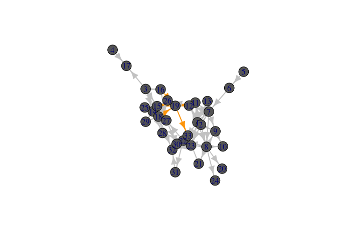<!-- -->

Network containing blue crab

``` r
library(igraph)
#setwd("YOUR WORKING DIRECTORY HERE")


# igraph's sir function does require the network to be simple (no loops or multiplex ties)
# Simplified graphs do not have any loops or multiplex ties. 
is.simple(net) #TRUE, so it's fine
```

    ## [1] TRUE

``` r
# igraph's sir function *also* needs the graph to be undirected
is_directed(net) #TRUE, so we need to change it
```

    ## [1] TRUE

``` r
un_net <- as.undirected(net)
is_directed(un_net) #FALSE, good
```

    ## [1] FALSE

``` r
# The igraph function uses different arguments than EpiModel
# beta is the rate of infection, gamma is the rate of recovery
sir52 <- sir(graph = un_net, beta = 5, gamma = 2) 
class(sir52) # output is a sir object/list. Use indexing to look inside. 
```

    ## [1] "sir"

``` r
invisible(sir52) # lots of pieces
sir52[[1]] # the first simulation
```

    ## $times
    ##  [1] 0.00000000 0.01617993 0.02326047 0.04442067 0.05279659 0.05408914
    ##  [7] 0.06343296 0.09486855 0.12036173 0.13235897 0.13939643 0.14169604
    ## [13] 0.15684527 0.15850973 0.15919256 0.16827539 0.17284717 0.18396573
    ## [19] 0.19784586 0.20435288 0.20541057 0.21202194 0.21799115 0.25788791
    ## [25] 0.27078471 0.27305995 0.29176216 0.29306735 0.29773456 0.30671630
    ## [31] 0.30779501 0.32367724 0.32772605 0.37324261 0.38748008 0.40006871
    ## [37] 0.40320327 0.40678030 0.43550692 0.43966217 0.45139282 0.46549500
    ## [43] 0.46703330 0.49343472 0.49611324 0.62752847 0.67385503 0.76387723
    ## [49] 0.87906438 0.98261495 1.05126739 1.18225857 1.31752142 1.35556939
    ## [55] 1.41519434 1.49823027 1.74984677 1.88357511
    ## 
    ## $NS
    ##  [1] 32 31 30 29 28 27 27 26 25 24 23 22 21 20 20 19 19 18 18 17 16 15 15 14 13
    ## [26] 12 12 11 10  9  8  8  7  7  7  6  6  5  5  4  4  4  4  4  4  4  4  4  4  4
    ## [51]  4  4  4  4  4  4  4  4
    ## 
    ## $NI
    ##  [1]  1  2  3  4  5  6  5  6  7  8  9 10 11 12 11 12 11 12 11 12 13 14 13 14 15
    ## [26] 16 15 16 17 18 19 18 19 18 17 18 17 18 17 18 17 16 15 14 13 12 11 10  9  8
    ## [51]  7  6  5  4  3  2  1  0
    ## 
    ## $NR
    ##  [1]  0  0  0  0  0  0  1  1  1  1  1  1  1  1  2  2  3  3  4  4  4  4  5  5  5
    ## [26]  5  6  6  6  6  6  7  7  8  9  9 10 10 11 11 12 13 14 15 16 17 18 19 20 21
    ## [51] 22 23 24 25 26 27 28 29

``` r
sir52[[1]]$times # times of events
```

    ##  [1] 0.00000000 0.01617993 0.02326047 0.04442067 0.05279659 0.05408914
    ##  [7] 0.06343296 0.09486855 0.12036173 0.13235897 0.13939643 0.14169604
    ## [13] 0.15684527 0.15850973 0.15919256 0.16827539 0.17284717 0.18396573
    ## [19] 0.19784586 0.20435288 0.20541057 0.21202194 0.21799115 0.25788791
    ## [25] 0.27078471 0.27305995 0.29176216 0.29306735 0.29773456 0.30671630
    ## [31] 0.30779501 0.32367724 0.32772605 0.37324261 0.38748008 0.40006871
    ## [37] 0.40320327 0.40678030 0.43550692 0.43966217 0.45139282 0.46549500
    ## [43] 0.46703330 0.49343472 0.49611324 0.62752847 0.67385503 0.76387723
    ## [49] 0.87906438 0.98261495 1.05126739 1.18225857 1.31752142 1.35556939
    ## [55] 1.41519434 1.49823027 1.74984677 1.88357511

``` r
sir52[[1]]$NS # number susceptible
```

    ##  [1] 32 31 30 29 28 27 27 26 25 24 23 22 21 20 20 19 19 18 18 17 16 15 15 14 13
    ## [26] 12 12 11 10  9  8  8  7  7  7  6  6  5  5  4  4  4  4  4  4  4  4  4  4  4
    ## [51]  4  4  4  4  4  4  4  4

``` r
sir52[[1]]$NI # number infected
```

    ##  [1]  1  2  3  4  5  6  5  6  7  8  9 10 11 12 11 12 11 12 11 12 13 14 13 14 15
    ## [26] 16 15 16 17 18 19 18 19 18 17 18 17 18 17 18 17 16 15 14 13 12 11 10  9  8
    ## [51]  7  6  5  4  3  2  1  0

``` r
sir52[[1]]$NR # number recovered
```

    ##  [1]  0  0  0  0  0  0  1  1  1  1  1  1  1  1  2  2  3  3  4  4  4  4  5  5  5
    ## [26]  5  6  6  6  6  6  7  7  8  9  9 10 10 11 11 12 13 14 15 16 17 18 19 20 21
    ## [51] 22 23 24 25 26 27 28 29

``` r
#plot(sir52) # shows all simulations at once
plot(sir52, comp = "NS")
```

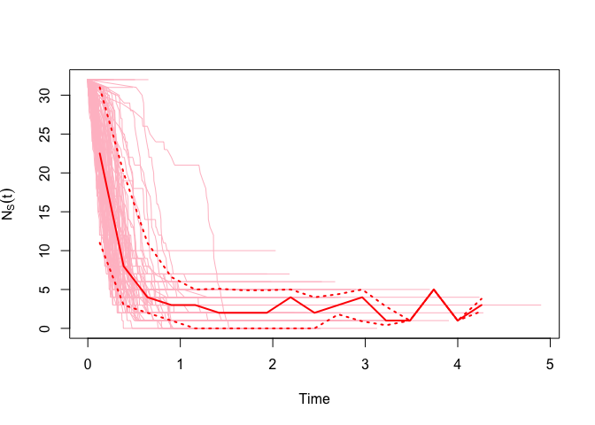<!-- -->

``` r
plot(sir52, comp = "NI")
```

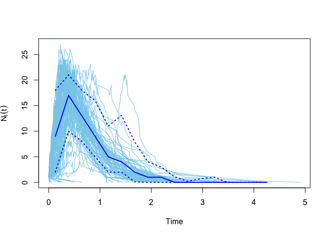<!-- -->

``` r
plot(sir52, comp = "NR")
```

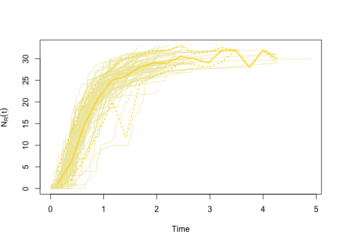<!-- -->
No Blue crab code

``` r
net_nbc <- graph_from_data_frame(Chesapeake_nbc, directed = T, vertices = union(unique(Chesapeake_nbc$V2), unique(Chesapeake_nbc$V1)))
net_nbc <- simplify(net_nbc, remove.multiple = F, remove.loops = T)
```

``` r
dim(Chesapeake_2)
```

    ## [1] 72  3

``` r
dim(Chesapeake_nbc)
```

    ## [1] 66  3

NO BLUE CRAB NETWORK

``` r
#GOOD 
ggraph(net_nbc) +
  geom_edge_link(color = "black", alpha = 0.3) +
  geom_node_point(color = "blue") +
  theme_graph()
```

    ## Using "sugiyama" as default layout

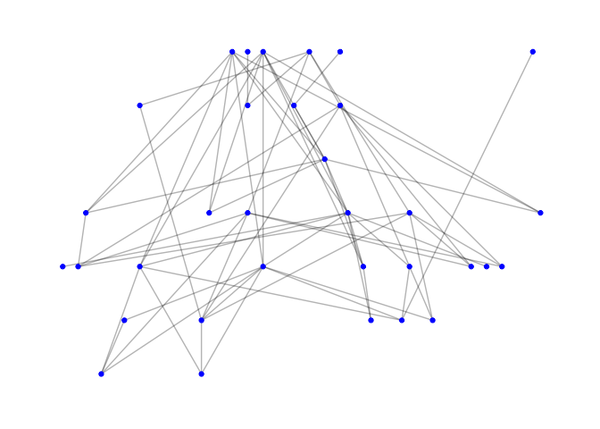<!-- -->

``` r
ggraph(net_nbc) +
  geom_edge_link(color = "black", alpha = 0.3) +
  geom_node_point(color = "blue", alpha = 0.8, size = igraph::degree(net, mode = "all")) +
  theme_graph()
```

    ## Using "sugiyama" as default layout

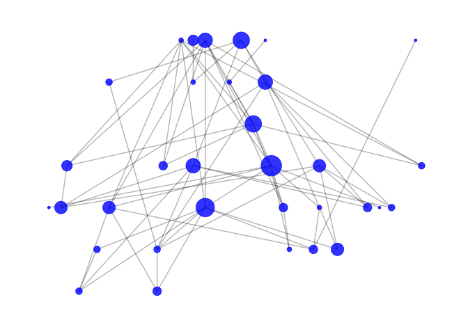<!-- -->

``` r
deg <- degree(net_nbc)
V(net_nbc)$size <- deg*3
```

NO BLUE CRAB CONTAGION

``` r
library(igraph)
#setwd("YOUR WORKING DIRECTORY HERE")


# igraph's sir function does require the network to be simple (no loops or multiplex ties)
# Simplified graphs do not have any loops or multiplex ties. 
is.simple(net_nbc) #TRUE, so it's fine
```

    ## [1] TRUE

``` r
# igraph's sir function *also* needs the graph to be undirected
is_directed(net_nbc) #TRUE, so we need to change it
```

    ## [1] TRUE

``` r
un_net <- as.undirected(net_nbc)
is_directed(un_net) #FALSE, good
```

    ## [1] FALSE

``` r
# The igraph function uses different arguments than EpiModel
# beta is the rate of infection, gamma is the rate of recovery
sir52 <- sir(graph = un_net, beta = 5, gamma = 2) 
class(sir52) # output is a sir object/list. Use indexing to look inside. 
```

    ## [1] "sir"

``` r
invisible(sir52) # lots of pieces
sir52[[1]] # the first simulation
```

    ## $times
    ## [1] 0.00000000 0.04146120 0.05286265 0.32849037
    ## 
    ## $NS
    ## [1] 32 31 31 31
    ## 
    ## $NI
    ## [1] 1 2 1 0
    ## 
    ## $NR
    ## [1] 0 0 1 2

``` r
sir52[[1]]$times # times of events
```

    ## [1] 0.00000000 0.04146120 0.05286265 0.32849037

``` r
sir52[[1]]$NS # number susceptible
```

    ## [1] 32 31 31 31

``` r
sir52[[1]]$NI # number infected
```

    ## [1] 1 2 1 0

``` r
sir52[[1]]$NR # number recovered
```

    ## [1] 0 0 1 2

``` r
plot(sir52) # shows all simulations at once
```

<!-- -->

``` r
plot(sir52, comp = "NS")
```

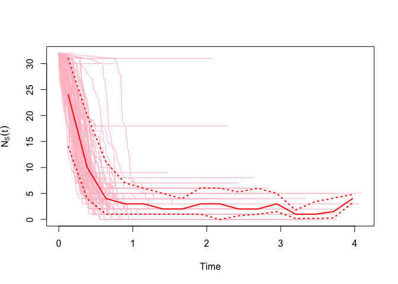<!-- -->

``` r
plot(sir52, comp = "NI")
```

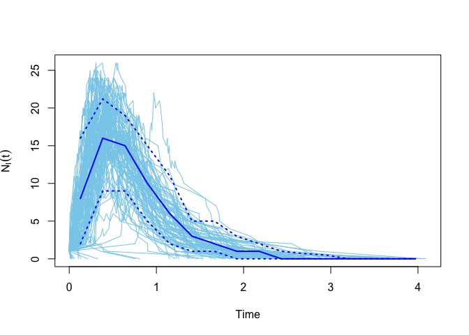<!-- -->

``` r
plot(sir52, comp = "NR")
```

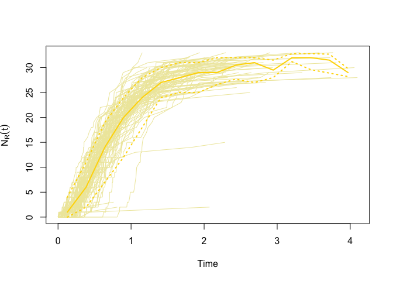<!-- -->

``` r
#vertex.label=V(net)$media
net.bg <- net
plot(net.bg, layout = layout_randomly)
```

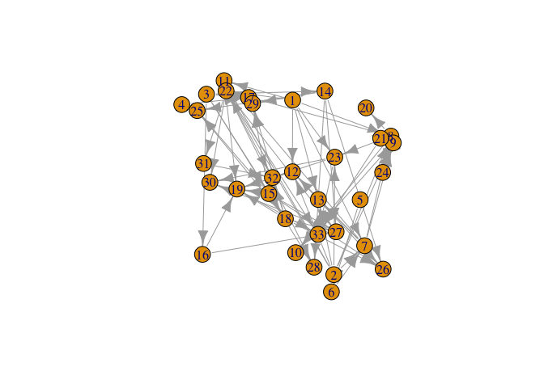<!-- -->

``` r
l <- layout_in_circle(net.bg)
plot(net.bg, layout=l, edge.arrow.size =.1)
```

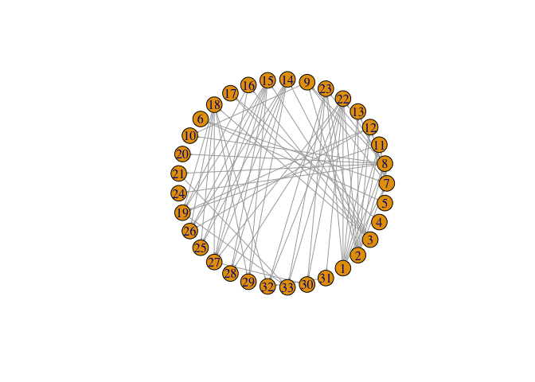<!-- -->

``` r
library(plyr)
library(tidyr)
```

    ## 
    ## Attaching package: 'tidyr'

    ## The following object is masked from 'package:igraph':
    ## 
    ##     crossing

``` r
library(statnet)
```

    ## Loading required package: tergm

    ## Loading required package: ergm

    ## Loading required package: network

    ## 
    ## 'network' 1.18.1 (2023-01-24), part of the Statnet Project
    ## * 'news(package="network")' for changes since last version
    ## * 'citation("network")' for citation information
    ## * 'https://statnet.org' for help, support, and other information

    ## 
    ## Attaching package: 'network'

    ## The following object is masked from 'package:plyr':
    ## 
    ##     is.discrete

    ## The following objects are masked from 'package:igraph':
    ## 
    ##     %c%, %s%, add.edges, add.vertices, delete.edges, delete.vertices,
    ##     get.edge.attribute, get.edges, get.vertex.attribute, is.bipartite,
    ##     is.directed, list.edge.attributes, list.vertex.attributes,
    ##     set.edge.attribute, set.vertex.attribute

    ## 
    ## 'ergm' 4.5.0 (2023-05-27), part of the Statnet Project
    ## * 'news(package="ergm")' for changes since last version
    ## * 'citation("ergm")' for citation information
    ## * 'https://statnet.org' for help, support, and other information

    ## 'ergm' 4 is a major update that introduces some backwards-incompatible
    ## changes. Please type 'news(package="ergm")' for a list of major
    ## changes.

    ## Loading required package: networkDynamic

    ## 
    ## 'networkDynamic' 0.11.3 (2023-02-15), part of the Statnet Project
    ## * 'news(package="networkDynamic")' for changes since last version
    ## * 'citation("networkDynamic")' for citation information
    ## * 'https://statnet.org' for help, support, and other information

    ## Registered S3 method overwritten by 'tergm':
    ##   method                   from
    ##   simulate_formula.network ergm

    ## 
    ## 'tergm' 4.2.0 (2023-05-30), part of the Statnet Project
    ## * 'news(package="tergm")' for changes since last version
    ## * 'citation("tergm")' for citation information
    ## * 'https://statnet.org' for help, support, and other information

    ## 
    ## Attaching package: 'tergm'

    ## The following object is masked from 'package:ergm':
    ## 
    ##     snctrl

    ## Loading required package: ergm.count

    ## 
    ## 'ergm.count' 4.1.1 (2022-05-24), part of the Statnet Project
    ## * 'news(package="ergm.count")' for changes since last version
    ## * 'citation("ergm.count")' for citation information
    ## * 'https://statnet.org' for help, support, and other information

    ## Loading required package: sna

    ## Loading required package: statnet.common

    ## 
    ## Attaching package: 'statnet.common'

    ## The following object is masked from 'package:ergm':
    ## 
    ##     snctrl

    ## The following objects are masked from 'package:base':
    ## 
    ##     attr, order

    ## sna: Tools for Social Network Analysis
    ## Version 2.7-1 created on 2023-01-24.
    ## copyright (c) 2005, Carter T. Butts, University of California-Irvine
    ##  For citation information, type citation("sna").
    ##  Type help(package="sna") to get started.

    ## 
    ## Attaching package: 'sna'

    ## The following objects are masked from 'package:igraph':
    ## 
    ##     betweenness, bonpow, closeness, components, degree, dyad.census,
    ##     evcent, hierarchy, is.connected, neighborhood, triad.census

    ## Loading required package: tsna

    ## 
    ## 'statnet' 2019.6 (2019-06-13), part of the Statnet Project
    ## * 'news(package="statnet")' for changes since last version
    ## * 'citation("statnet")' for citation information
    ## * 'https://statnet.org' for help, support, and other information

    ## unable to reach CRAN

``` r
library(ggplot2)
library(ggnetwork)
library(dplyr)
```

    ## 
    ## Attaching package: 'dplyr'

    ## The following objects are masked from 'package:plyr':
    ## 
    ##     arrange, count, desc, failwith, id, mutate, rename, summarise,
    ##     summarize

    ## The following objects are masked from 'package:igraph':
    ## 
    ##     as_data_frame, groups, union

    ## The following objects are masked from 'package:stats':
    ## 
    ##     filter, lag

    ## The following objects are masked from 'package:base':
    ## 
    ##     intersect, setdiff, setequal, union

``` r
library(igraph) 
library(igraphdata)
library(ggraph)
library(gplots)
```

    ## 
    ## Attaching package: 'gplots'

    ## The following object is masked from 'package:stats':
    ## 
    ##     lowess

create net_sna object

``` r
net_sna <- network(Chesapeake_2, matrix.type = "edgelist", directed = T, loops = TRUE)
net_sna
```

    ##  Network attributes:
    ##   vertices = 33 
    ##   directed = TRUE 
    ##   hyper = FALSE 
    ##   loops = TRUE 
    ##   multiple = FALSE 
    ##   bipartite = FALSE 
    ##   total edges= 72 
    ##     missing edges= 0 
    ##     non-missing edges= 72 
    ## 
    ##  Vertex attribute names: 
    ##     vertex.names 
    ## 
    ##  Edge attribute names: 
    ##     V3

Run a CUG Test

``` r
Cug_Size <- cug.test(net_sna, gtrans, cmode="size")
plot(Cug_Size) 
```

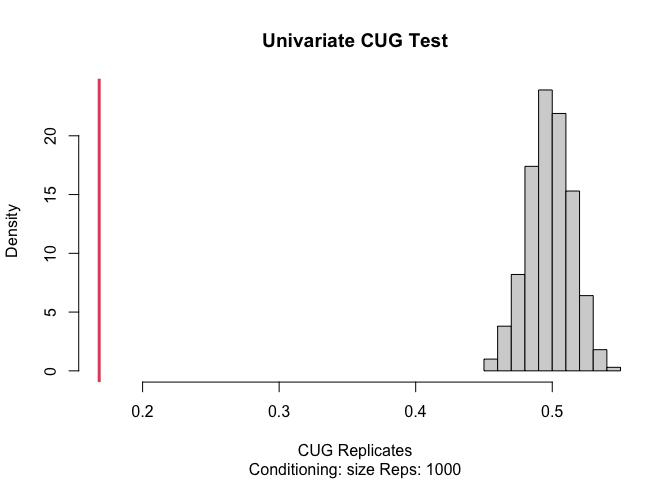<!-- -->

Find the strong cut-set of the graph

``` r
cp <- cutpoints(net_sna, mode = "digraph")
cp
```

    ## integer(0)

Calculate the cluster-louvain algorithm on this graph, find number of
communities plus mod

``` r
un_net <- graph_from_data_frame(Chesapeake_2, directed = F, vertices = nodelist)
clv <- cluster_louvain(un_net, weights = NULL)
length(clv)
```

    ## [1] 10

``` r
modularity(clv) 
```

    ## [1] 0.4270833

Calculate spin-glass, find number of communities plus mod

``` r
sgc <- cluster_spinglass(net)
length(sgc)
```

    ## [1] 6

``` r
modularity(sgc) 
```

    ## [1] 0.4304701

Increase resolution parameter, how does it affect number of communities
and modularity

``` r
clv_5 <- cluster_louvain(un_net, resolution = 0.5)
length(clv_5)
```

    ## [1] 8

``` r
modularity(clv_5)
```

    ## [1] 0.6155478

Plot Communities

``` r
library(igraph) 
set.seed(12345)
E(net)$weight <- sample(x = 1:10, size = ecount(net), replace = TRUE)
cl <- cluster_louvain(un_net)
# V(net)$name <- membership(cl)
x <- as_edgelist(net, names = T)
V(net)$name <- 1:vcount(net)
E(net)[x[,1] != x[,2]]
```

    ## + 71/71 edges from 77e887b (vertex names):
    ##  [1] 29-> 1 29-> 2 29-> 3 29-> 4 29-> 5 29-> 6 29-> 7 30-> 1 30-> 2 30-> 8
    ## [11] 30-> 3 30-> 4 30-> 5 30-> 6 30-> 7 31-> 9 31->10 31->11 31->12 31->13
    ## [21] 32->12 33->14 14-> 1  1-> 2  1-> 8  1-> 3  1-> 4  1-> 5  2-> 8  2->15
    ## [31]  2->16  2->17  2-> 6  2-> 7  2->18  8->15  3->19  4->19  4->20  9->21
    ## [41]  9->20  9->22  9->23  9->24 10->19 10->21 10->20 10->22 10->23 10->24
    ## [51] 11->19 11->22 13->19 13->21 13->20 13->22 13->24 13->25 19->26 17->26
    ## [61]  6->22  6->23  6->27  6->28  6->25  6->26  7->27  7->25  7->26 22->27
    ## [71] 28->25

``` r
 E(net)$color <- ifelse(x[,1] != x[,2], "red", "blue")
 plot(net, edge.color = E(net)$color)
```

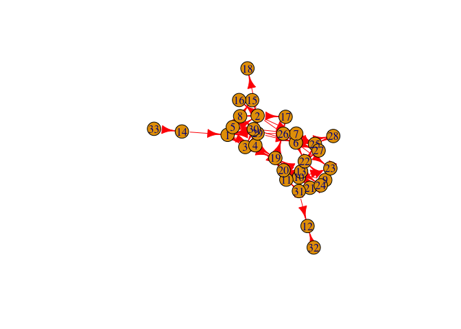<!-- -->

``` r
 plot(cl, un_net)
```

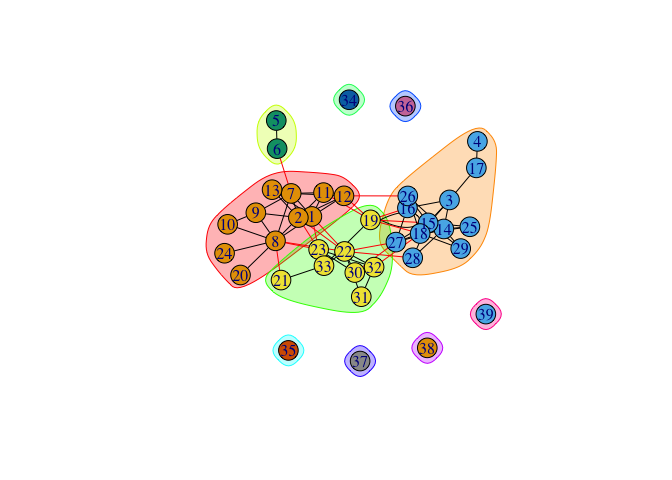<!-- -->

Centrality Measures

Degree Measures

``` r
# DEGREE
deg <- igraph::degree(net)
deg
```

    ##  1  2  3  4  5  6  7  8  9 10 11 12 13 14 15 16 17 18 19 20 21 22 23 24 25 26 
    ##  8 10  4  5  3  9  6  4  6  7  3  2  7  2  2  1  2  1  6  4  3  6  3  3  4  4 
    ## 27 28 29 30 31 32 33 
    ##  3  2  7  8  5  1  1

``` r
ggraph(net) + 
  geom_edge_link0(color = "grey") +
  geom_node_point(color = "blue", 
                  size = V(net)$size <- igraph::degree(net, mode = "all")/3) +
  ggnetwork::theme_blank()
```

    ## Using "sugiyama" as default layout

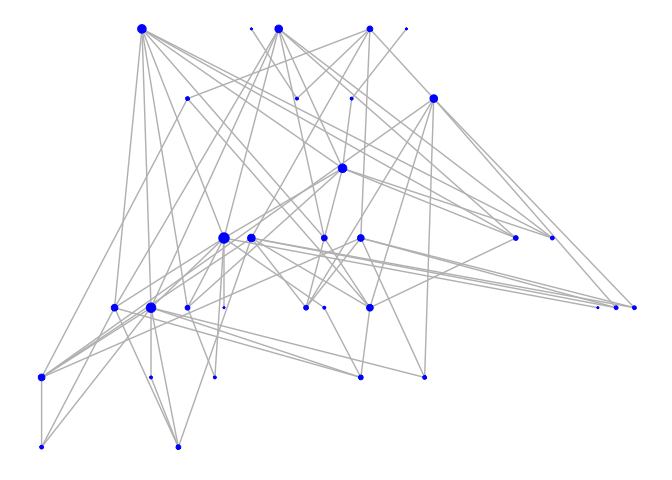<!-- -->

``` r
# IN DEGREE
deg_in <- igraph::degree(net, mode = "in")
deg_in
```

    ##  1  2  3  4  5  6  7  8  9 10 11 12 13 14 15 16 17 18 19 20 21 22 23 24 25 26 
    ##  3  3  3  3  3  3  3  3  1  1  1  2  1  1  2  1  1  1  5  4  3  5  3  3  4  4 
    ## 27 28 29 30 31 32 33 
    ##  3  1  0  0  0  0  0

``` r
ggraph(net) + 
  geom_edge_link(color = "grey", 
                 arrow = arrow(length = unit(2, 'mm')), 
                 start_cap = circle(2, 'mm'),
                 end_cap = circle(2, 'mm')) + 
  geom_node_point(color = "blue", 
                  size = igraph::degree(net, mode = "in")) +
#  geom_node_text(aes(label = name)) +
  ggnetwork::theme_blank()
```

    ## Using "sugiyama" as default layout

<!-- -->

``` r
# OUT DEGREE
deg_out <- igraph::degree(net, mode = "out")
deg_out
```

    ##  1  2  3  4  5  6  7  8  9 10 11 12 13 14 15 16 17 18 19 20 21 22 23 24 25 26 
    ##  5  7  1  2  0  6  3  1  5  6  2  0  6  1  0  0  1  0  1  0  0  1  0  0  0  0 
    ## 27 28 29 30 31 32 33 
    ##  0  1  7  8  5  1  1

``` r
ggraph(net) + 
  geom_edge_link(color = "grey", 
                 arrow = arrow(length = unit(2, 'mm')), 
                 start_cap = circle(2, 'mm'),
                 end_cap = circle(2, 'mm')) +
  geom_node_point(color = "blue", 
                  size = V(net)$size <- igraph::degree(net, mode = "out")) + 
#  geom_node_text(aes(label = name)) +
  ggnetwork::theme_blank()
```

    ## Using "sugiyama" as default layout

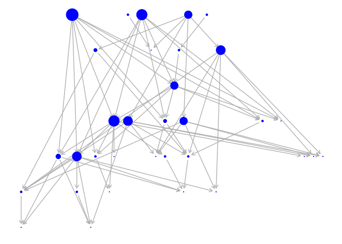<!-- -->

Closeness Measures

``` r
# CLOSENESS
close <- igraph::closeness(net)
close
```

    ##           1           2           3           4           5           6 
    ## 0.006622517 0.013157895 0.037037037 0.033333333         NaN 0.033333333 
    ##           7           8           9          10          11          12 
    ## 0.050000000 0.200000000 0.027777778 0.016666667 0.027027027         NaN 
    ##          13          14          15          16          17          18 
    ## 0.012500000 0.003436426         NaN         NaN 0.100000000         NaN 
    ##          19          20          21          22          23          24 
    ## 0.142857143         NaN         NaN 0.100000000         NaN         NaN 
    ##          25          26          27          28          29          30 
    ##         NaN         NaN         NaN 0.100000000 0.006172840 0.005813953 
    ##          31          32          33 
    ## 0.007246377 0.250000000 0.001996008

``` r
is_directed(net)
```

    ## [1] TRUE

``` r
un_net <- as.undirected(net)

ggraph(un_net) + 
  geom_edge_link0(color = "grey") +
  geom_node_point(color = "blue", 
                  size = igraph::closeness(un_net)*250) +
  ggnetwork::theme_blank()
```

    ## Using "stress" as default layout

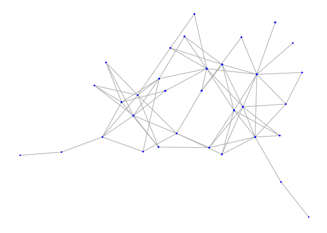<!-- -->

``` r
# IN CLOSENESS
close_in <- igraph::closeness(net, mode = "in")
close_in
```

    ##           1           2           3           4           5           6 
    ## 0.030303030 0.023809524 0.016666667 0.014492754 0.020000000 0.020000000 
    ##           7           8           9          10          11          12 
    ## 0.024390244 0.016393443 0.250000000 0.125000000 0.100000000 0.142857143 
    ##          13          14          15          16          17          18 
    ## 0.111111111 0.100000000 0.012048193 0.010416667 0.013888889 0.020833333 
    ##          19          20          21          22          23          24 
    ## 0.006060606 0.009009009 0.040000000 0.007812500 0.010526316 0.030303030 
    ##          25          26          27          28          29          30 
    ## 0.006944444 0.005617978 0.006802721 0.012820513         NaN         NaN 
    ##          31          32          33 
    ##         NaN         NaN         NaN

``` r
ggraph(net) + 
  geom_edge_link0(color = "grey", 
                  arrow = arrow(length = unit(2, 'mm')), 
                  start_cap = circle(2, 'mm'),
                  end_cap = circle(2, 'mm')) +
  geom_node_point(color = "blue", 
                  size = igraph::closeness(net, mode = "in")*10) +
#  geom_node_text(aes(label = name)) +
  ggnetwork::theme_blank()
```

    ## Using "sugiyama" as default layout

    ## Warning in geom_edge_link0(color = "grey", arrow = arrow(length = unit(2, :
    ## Ignoring unknown parameters: `start_cap` and `end_cap`

    ## Warning: Removed 5 rows containing missing values (`geom_point()`).

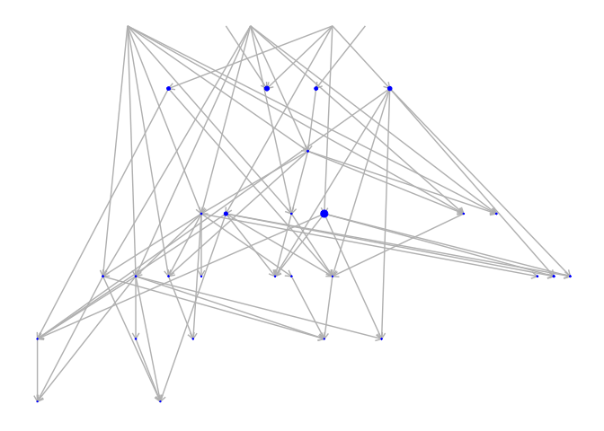<!-- -->

``` r
# OUT CLOSENESS
close_out <- igraph::closeness(net, mode = "out")
close_out
```

    ##           1           2           3           4           5           6 
    ## 0.006622517 0.013157895 0.037037037 0.033333333         NaN 0.033333333 
    ##           7           8           9          10          11          12 
    ## 0.050000000 0.200000000 0.027777778 0.016666667 0.027027027         NaN 
    ##          13          14          15          16          17          18 
    ## 0.012500000 0.003436426         NaN         NaN 0.100000000         NaN 
    ##          19          20          21          22          23          24 
    ## 0.142857143         NaN         NaN 0.100000000         NaN         NaN 
    ##          25          26          27          28          29          30 
    ##         NaN         NaN         NaN 0.100000000 0.006172840 0.005813953 
    ##          31          32          33 
    ## 0.007246377 0.250000000 0.001996008

``` r
ggraph(net) + 
  geom_edge_link0(color = "grey", 
                  arrow = arrow(length = unit(2, 'mm')), 
                  start_cap = circle(2, 'mm'),
                  end_cap = circle(2, 'mm')) +
  geom_node_point(color = "blue", 
                  size = igraph::closeness(net, mode = "out")*10) +
  ggnetwork::theme_blank()
```

    ## Using "sugiyama" as default layout

    ## Warning in geom_edge_link0(color = "grey", arrow = arrow(length = unit(2, :
    ## Ignoring unknown parameters: `start_cap` and `end_cap`

    ## Warning: Removed 12 rows containing missing values (`geom_point()`).

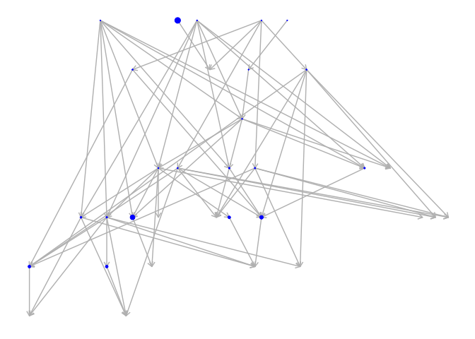<!-- -->

Betweenness

``` r
bet_d <- igraph::betweenness(net, directed = T)
bet_d
```

    ##    1    2    3    4    5    6    7    8    9   10   11   12   13   14   15   16 
    ## 46.0 44.5  3.5  6.5  0.0 26.0 10.0  0.0  5.0  1.0  2.0  0.0  1.0 20.0  0.0  0.0 
    ##   17   18   19   20   21   22   23   24   25   26   27   28   29   30   31   32 
    ##  0.0  0.0  6.0  0.0  0.0  5.0  0.0  0.0  0.0  0.0  0.0  0.0  0.0  0.0  0.0  0.0 
    ##   33 
    ##  0.0

``` r
ggraph(net) + 
  geom_edge_link0(color = "grey") + 
  geom_node_point(color = "blue", 
                  size = igraph::betweenness(net, directed = T)/5) +
#  geom_node_text(aes(label = name)) +
  ggnetwork::theme_blank()
```

    ## Using "sugiyama" as default layout

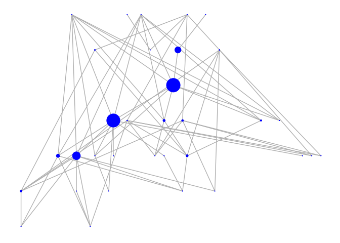<!-- -->

Edge Betweenness

``` r
eb_n <- edge.betweenness(net, directed = T)
eb_n
```

    ##  [1]  8.5  0.0  2.0  2.0  0.0  7.0  0.5  1.5  5.0  0.5  2.0  2.0  1.0  5.0  3.0
    ## [16]  6.0  2.0  3.0  1.0  2.0  1.0 21.0 40.0 44.5  4.5  4.5  7.5  4.0  1.0  6.0
    ## [31]  6.0  6.0 20.0 12.5  6.0  1.0  5.5  3.5  6.0  2.0  2.0  4.0  1.0  2.0  2.0
    ## [46]  1.0  1.0  2.0  2.0  1.0  4.0  2.0  2.0  1.0  1.0  2.0  1.0  2.0  7.0  1.0
    ## [61]  7.0  7.0  2.0  7.0  2.0  7.0  6.0  6.0  1.0  6.0  1.0

``` r
ggraph(net) + 
  geom_edge_link0(color = "grey", 
                  aes(width = edge.betweenness(net, directed = T))) +
  scale_edge_width(range = c(0.15, 1)) +
  geom_node_point(color = "blue") +
  ggnetwork::theme_blank() + theme(legend.position = "none")
```

    ## Using "sugiyama" as default layout

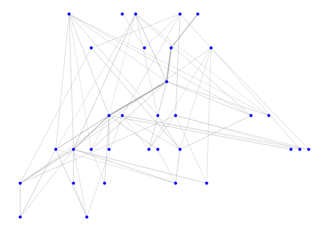<!-- -->

ERGM Models

``` r
Chesapeake <- read.table("Chesapeake.paj", quote="\"", comment.char="")
Chesapeake_1 <- Chesapeake[Chesapeake$V1 %in% 1:33, ]
Chesapeake_2 <- Chesapeake_1[Chesapeake_1$V2 %in% 1:33, ]
Chesapeake_2
```

    ##     V1 V2           V3
    ## 56   1  7 3.367145e+04
    ## 57   1  8 3.944067e+04
    ## 58   1 11 4.458031e+03
    ## 59   1 12 2.415342e+03
    ## 60   1 13 4.687355e+03
    ## 61   1 22 2.940877e+02
    ## 62   1 23 2.208312e+01
    ## 65   2  7 1.443316e+03
    ## 66   2  8 1.131006e+03
    ## 67   2  9 1.241849e+02
    ## 68   2 11 1.584640e+02
    ## 69   2 12 7.102142e+01
    ## 70   2 13 1.099190e+02
    ## 71   2 22 1.334218e+01
    ## 72   2 23 5.131606e+00
    ## 75   3 14 1.348963e+05
    ## 76   3 15 2.102110e+04
    ## 77   3 16 4.808909e+04
    ## 78   3 17 3.016274e+04
    ## 79   3 18 1.180524e+04
    ## 81   4 17 1.808600e+04
    ## 83   5  6 9.101112e+04
    ## 85   6  7 3.245466e+04
    ## 87   7  8 7.850837e+03
    ## 88   7  9 3.571585e+03
    ## 89   7 11 3.013558e+02
    ## 90   7 12 1.621086e+02
    ## 91   7 13 3.159040e+02
    ## 93   8  9 7.165512e+03
    ## 94   8 10 1.207448e+03
    ## 95   8 20 5.104828e+00
    ## 96   8 21 2.677430e+01
    ## 97   8 22 1.598124e+03
    ## 98   8 23 2.585752e+02
    ## 99   8 24 5.417368e+00
    ## 101  9 10 5.725732e+02
    ## 106 11 19 5.561747e+02
    ## 108 12 19 2.251819e+02
    ## 109 12 26 9.426217e+00
    ## 112 14 25 6.004372e+00
    ## 113 14 26 4.920249e+01
    ## 114 14 27 2.618573e+02
    ## 115 14 28 6.337948e+01
    ## 116 14 29 1.274261e+02
    ## 118 15 19 2.935468e+02
    ## 119 15 25 1.751274e+00
    ## 120 15 26 1.167516e+01
    ## 121 15 27 8.089216e+01
    ## 122 15 28 4.920245e+01
    ## 123 15 29 1.884704e+01
    ## 125 16 19 3.784450e+03
    ## 126 16 27 4.586706e+01
    ## 129 18 19 8.064227e+02
    ## 130 18 25 2.501829e-01
    ## 131 18 26 1.167520e+01
    ## 132 18 27 1.667886e+00
    ## 133 18 29 3.594294e+01
    ## 134 18 32 7.505485e-01
    ## 136 19 19 2.497562e+02
    ## 137 19 33 2.045784e+00
    ## 140 21 33 2.083602e-01
    ## 142 22 27 1.510978e+01
    ## 143 22 28 1.521399e+01
    ## 144 22 30 2.813546e+00
    ## 145 22 31 9.524374e+01
    ## 146 22 32 1.281727e+01
    ## 147 22 33 1.792333e+01
    ## 149 23 30 2.699752e+00
    ## 150 23 32 8.306931e+00
    ## 151 23 33 1.100668e+01
    ## 156 27 30 8.570167e+00
    ## 161 31 32 4.480828e+00

Data Cleaning: Removing the self-loop on node 19

``` r
Chesapeake_2[59,]
```

    ##     V1 V2       V3
    ## 136 19 19 249.7562

``` r
Chesapeake_2 <- Chesapeake_2[-(59),]
Chesapeake_2
```

    ##     V1 V2           V3
    ## 56   1  7 3.367145e+04
    ## 57   1  8 3.944067e+04
    ## 58   1 11 4.458031e+03
    ## 59   1 12 2.415342e+03
    ## 60   1 13 4.687355e+03
    ## 61   1 22 2.940877e+02
    ## 62   1 23 2.208312e+01
    ## 65   2  7 1.443316e+03
    ## 66   2  8 1.131006e+03
    ## 67   2  9 1.241849e+02
    ## 68   2 11 1.584640e+02
    ## 69   2 12 7.102142e+01
    ## 70   2 13 1.099190e+02
    ## 71   2 22 1.334218e+01
    ## 72   2 23 5.131606e+00
    ## 75   3 14 1.348963e+05
    ## 76   3 15 2.102110e+04
    ## 77   3 16 4.808909e+04
    ## 78   3 17 3.016274e+04
    ## 79   3 18 1.180524e+04
    ## 81   4 17 1.808600e+04
    ## 83   5  6 9.101112e+04
    ## 85   6  7 3.245466e+04
    ## 87   7  8 7.850837e+03
    ## 88   7  9 3.571585e+03
    ## 89   7 11 3.013558e+02
    ## 90   7 12 1.621086e+02
    ## 91   7 13 3.159040e+02
    ## 93   8  9 7.165512e+03
    ## 94   8 10 1.207448e+03
    ## 95   8 20 5.104828e+00
    ## 96   8 21 2.677430e+01
    ## 97   8 22 1.598124e+03
    ## 98   8 23 2.585752e+02
    ## 99   8 24 5.417368e+00
    ## 101  9 10 5.725732e+02
    ## 106 11 19 5.561747e+02
    ## 108 12 19 2.251819e+02
    ## 109 12 26 9.426217e+00
    ## 112 14 25 6.004372e+00
    ## 113 14 26 4.920249e+01
    ## 114 14 27 2.618573e+02
    ## 115 14 28 6.337948e+01
    ## 116 14 29 1.274261e+02
    ## 118 15 19 2.935468e+02
    ## 119 15 25 1.751274e+00
    ## 120 15 26 1.167516e+01
    ## 121 15 27 8.089216e+01
    ## 122 15 28 4.920245e+01
    ## 123 15 29 1.884704e+01
    ## 125 16 19 3.784450e+03
    ## 126 16 27 4.586706e+01
    ## 129 18 19 8.064227e+02
    ## 130 18 25 2.501829e-01
    ## 131 18 26 1.167520e+01
    ## 132 18 27 1.667886e+00
    ## 133 18 29 3.594294e+01
    ## 134 18 32 7.505485e-01
    ## 137 19 33 2.045784e+00
    ## 140 21 33 2.083602e-01
    ## 142 22 27 1.510978e+01
    ## 143 22 28 1.521399e+01
    ## 144 22 30 2.813546e+00
    ## 145 22 31 9.524374e+01
    ## 146 22 32 1.281727e+01
    ## 147 22 33 1.792333e+01
    ## 149 23 30 2.699752e+00
    ## 150 23 32 8.306931e+00
    ## 151 23 33 1.100668e+01
    ## 156 27 30 8.570167e+00
    ## 161 31 32 4.480828e+00

``` r
net
```

    ## IGRAPH 77e887b DNW- 33 71 -- 
    ## + attr: name (v/n), size (v/n), V3 (e/n), weight (e/n), color (e/c)
    ## + edges from 77e887b (vertex names):
    ##  [1] 29-> 1 29-> 2 29-> 3 29-> 4 29-> 5 29-> 6 29-> 7 30-> 1 30-> 2 30-> 8
    ## [11] 30-> 3 30-> 4 30-> 5 30-> 6 30-> 7 31-> 9 31->10 31->11 31->12 31->13
    ## [21] 32->12 33->14 14-> 1  1-> 2  1-> 8  1-> 3  1-> 4  1-> 5  2-> 8  2->15
    ## [31]  2->16  2->17  2-> 6  2-> 7  2->18  8->15  3->19  4->19  4->20  9->21
    ## [41]  9->20  9->22  9->23  9->24 10->19 10->21 10->20 10->22 10->23 10->24
    ## [51] 11->19 11->22 13->19 13->21 13->20 13->22 13->24 13->25 19->26 17->26
    ## [61]  6->22  6->23  6->27  6->28  6->25  6->26  7->27  7->25  7->26 22->27
    ## [71] 28->25

``` r
ggraph(net) +
  geom_edge_link(color = "black", alpha = 0.3) +
  geom_node_point(color = "blue") +
  theme_graph()
```

    ## Using "sugiyama" as default layout

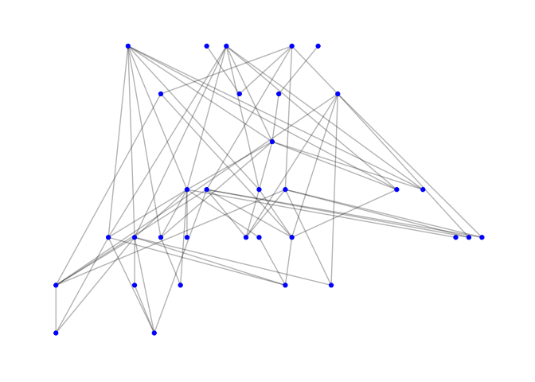<!-- -->

``` r
library(ergm)
library(ggraph)
library(statnet)
```

``` r
net_sna <- network(Chesapeake_2, matrix.type = "edgelist", directed = T, loops = FALSE)
net_sna
```

    ##  Network attributes:
    ##   vertices = 33 
    ##   directed = TRUE 
    ##   hyper = FALSE 
    ##   loops = FALSE 
    ##   multiple = FALSE 
    ##   bipartite = FALSE 
    ##   total edges= 71 
    ##     missing edges= 0 
    ##     non-missing edges= 71 
    ## 
    ##  Vertex attribute names: 
    ##     vertex.names 
    ## 
    ##  Edge attribute names: 
    ##     V3

``` r
model1 <- ergm(net_sna ~ edges)
```

    ## Starting maximum pseudolikelihood estimation (MPLE):

    ## Obtaining the responsible dyads.

    ## Evaluating the predictor and response matrix.

    ## Maximizing the pseudolikelihood.

    ## Finished MPLE.

    ## Evaluating log-likelihood at the estimate.

``` r
ggraph(net_sna) +
  geom_edge_link0(color = "black") +
  geom_node_point(color = "#DFE6EB") +
  ggnetwork::theme_blank()
```

    ## Using "sugiyama" as default layout

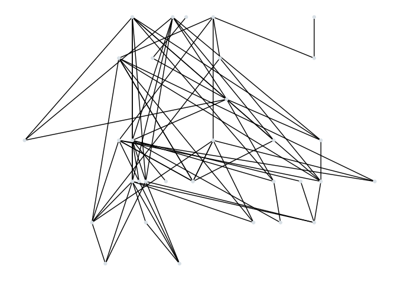<!-- -->

ERGM

``` r
model1 <- ergm(net_sna ~ edges)
```

    ## Starting maximum pseudolikelihood estimation (MPLE):

    ## Obtaining the responsible dyads.

    ## Evaluating the predictor and response matrix.

    ## Maximizing the pseudolikelihood.

    ## Finished MPLE.

    ## Evaluating log-likelihood at the estimate.

``` r
summary(model1)
```

    ## Call:
    ## ergm(formula = net_sna ~ edges)
    ## 
    ## Maximum Likelihood Results:
    ## 
    ##       Estimate Std. Error MCMC % z value Pr(>|z|)    
    ## edges  -2.6300     0.1229      0   -21.4   <1e-04 ***
    ## ---
    ## Signif. codes:  0 '***' 0.001 '**' 0.01 '*' 0.05 '.' 0.1 ' ' 1
    ## 
    ##      Null Deviance: 1463.9  on 1056  degrees of freedom
    ##  Residual Deviance:  520.5  on 1055  degrees of freedom
    ##  
    ## AIC: 522.5  BIC: 527.4  (Smaller is better. MC Std. Err. = 0)

``` r
summary(net_sna ~ edges)
```

    ## edges 
    ##    71

prob

``` r
mod_sum <- summary(model1)
mod_sum #log-odds
```

    ## Call:
    ## ergm(formula = net_sna ~ edges)
    ## 
    ## Maximum Likelihood Results:
    ## 
    ##       Estimate Std. Error MCMC % z value Pr(>|z|)    
    ## edges  -2.6300     0.1229      0   -21.4   <1e-04 ***
    ## ---
    ## Signif. codes:  0 '***' 0.001 '**' 0.01 '*' 0.05 '.' 0.1 ' ' 1
    ## 
    ##      Null Deviance: 1463.9  on 1056  degrees of freedom
    ##  Residual Deviance:  520.5  on 1055  degrees of freedom
    ##  
    ## AIC: 522.5  BIC: 527.4  (Smaller is better. MC Std. Err. = 0)

``` r
exp(coef(mod_sum)[1]) #odds
```

    ## [1] 0.07208122

``` r
beta <- coef(mod_sum)[1]
beta
```

    ## [1] -2.629962

``` r
prob <- exp(beta)/(1+exp(beta))
prob
```

    ## [1] 0.06723485

``` r
plogis(beta)
```

    ## [1] 0.06723485

``` r
plogis(coef(model1)[['edges']])
```

    ## [1] 0.06723485

the probability of forming a tie with someone else at random is 6.7%

``` r
gden(net_sna)
```

    ## [1] 0.06723485

simulation

``` r
set.seed(123)
ergm1 <- simulate(model1)
ggraph(ergm1) +
  geom_edge_link0(color = "black") +
  geom_node_point(color = "#DFE6EB") +
  ggnetwork::theme_blank()
```

    ## Using "stress" as default layout

<!-- -->

``` r
  # gof####
model1_gof <- gof(model1) 
model1_gof
```

    ## 
    ## Goodness-of-fit for in-degree 
    ## 
    ##          obs min mean max MC p-value
    ## idegree0   5   0 3.03   7       0.40
    ## idegree1   9   1 8.59  15       1.00
    ## idegree2   2   2 9.24  15       0.04
    ## idegree3  12   2 6.61  12       0.02
    ## idegree4   3   0 3.52   8       1.00
    ## idegree5   2   0 1.48   5       0.90
    ## idegree6   0   0 0.40   2       1.00
    ## idegree7   0   0 0.11   2       1.00
    ## idegree8   0   0 0.02   1       1.00
    ## 
    ## Goodness-of-fit for out-degree 
    ## 
    ##          obs min mean max MC p-value
    ## odegree0  12   0 3.34   8       0.00
    ## odegree1   9   4 8.43  15       0.92
    ## odegree2   2   3 8.66  14       0.00
    ## odegree3   1   2 7.13  13       0.00
    ## odegree4   0   0 3.38   7       0.04
    ## odegree5   3   0 1.41   6       0.34
    ## odegree6   3   0 0.57   3       0.06
    ## odegree7   2   0 0.06   2       0.02
    ## odegree8   1   0 0.02   1       0.04
    ## 
    ## Goodness-of-fit for edgewise shared partner 
    ## 
    ##          obs min  mean max MC p-value
    ## esp.OTP0  54  46 62.39  76       0.20
    ## esp.OTP1  16   1  8.73  19       0.12
    ## esp.OTP2   1   0  0.55   3       0.88
    ## esp.OTP3   0   0  0.04   1       1.00
    ## 
    ## Goodness-of-fit for minimum geodesic distance 
    ## 
    ##     obs min   mean max MC p-value
    ## 1    71  52  71.71  90       0.96
    ## 2    61  71 132.06 193       0.00
    ## 3    21  80 177.47 284       0.00
    ## 4    14  46 163.59 240       0.00
    ## 5     6  20 112.03 176       0.00
    ## 6     0   9  63.80 115       0.00
    ## 7     0   3  32.81  97       0.00
    ## 8     0   0  15.87  79       0.16
    ## 9     0   0   7.54  54       0.64
    ## 10    0   0   3.33  30       1.00
    ## 11    0   0   1.14  14       1.00
    ## 12    0   0   0.46  11       1.00
    ## 13    0   0   0.10   5       1.00
    ## Inf 883   0 274.09 699       0.00
    ## 
    ## Goodness-of-fit for model statistics 
    ## 
    ##        obs        min       mean        max MC p-value 
    ##      71.00      52.00      71.71      90.00       0.96

``` r
# We use GOF to see if our simulated network is like our real network
# If the fit is poor, we need to re-specify
```

``` r
plot(model1_gof) 
```

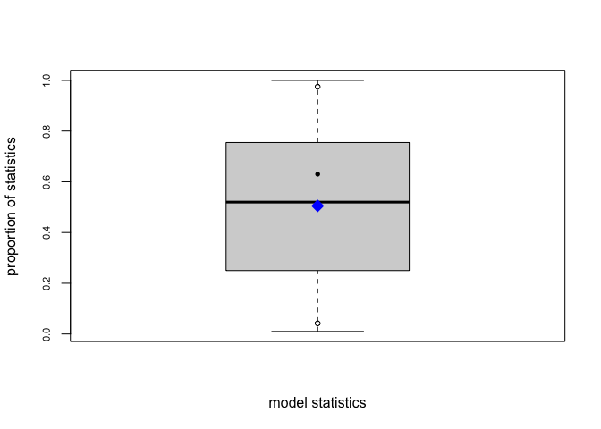<!-- -->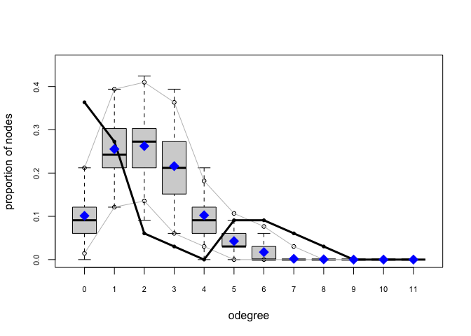<!-- -->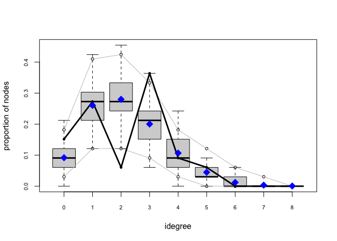<!-- -->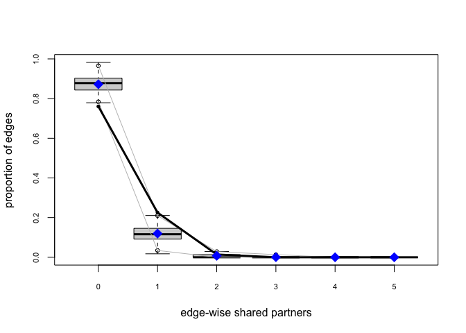<!-- -->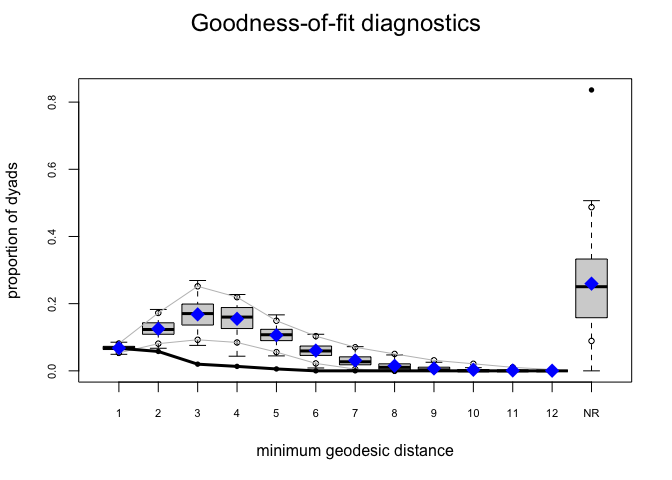<!-- -->

Compare to our model

``` r
model1_gof_model = gof(model1, GOF = ~ model)
model1_gof_model
```

    ## 
    ## Goodness-of-fit for model statistics 
    ## 
    ##        obs        min       mean        max MC p-value 
    ##      71.00      53.00      70.10      89.00       0.92

``` r
gof(model1, GOF = ~ triadcensus)
```

    ## 
    ## Goodness-of-fit for triad census 
    ## 
    ##                   obs  min    mean  max MC p-value
    ## triadcensus.003  3570 3223 3635.00 4098       0.76
    ## triadcensus.012  1589 1205 1526.84 1831       0.70
    ## triadcensus.102     0    0   53.60  153       0.20
    ## triadcensus.021D  132   26   53.50   93       0.00
    ## triadcensus.021U   58   20   53.00   92       0.74
    ## triadcensus.021C   89   60  107.50  171       0.52
    ## triadcensus.111D    0    0    7.63   24       0.20
    ## triadcensus.111U    0    0    7.27   23       0.22
    ## triadcensus.030T   18    0    7.83   23       0.04
    ## triadcensus.030C    0    0    2.54    8       0.24
    ## triadcensus.201     0    0    0.25    3       1.00
    ## triadcensus.120D    0    0    0.24    2       1.00
    ## triadcensus.120U    0    0    0.26    3       1.00
    ## triadcensus.120C    0    0    0.52    3       1.00
    ## triadcensus.210     0    0    0.02    1       1.00
    ## 
    ## Goodness-of-fit for model statistics 
    ## 
    ##        obs        min       mean        max MC p-value 
    ##      71.00      48.00      69.13      87.00       0.86

Adding Reciprocity

``` r
model2 <- ergm(net_sna ~ edges + mutual)
```

    ## Observed statistic(s) mutual are at their smallest attainable values. Their coefficients will be fixed at -Inf.

    ## Starting maximum pseudolikelihood estimation (MPLE):

    ## Obtaining the responsible dyads.

    ## Evaluating the predictor and response matrix.

    ## Maximizing the pseudolikelihood.

    ## Finished MPLE.

    ## Starting Monte Carlo maximum likelihood estimation (MCMLE):

    ## Iteration 1 of at most 60:

    ## Warning: 'glpk' selected as the solver, but package 'Rglpk' is not available;
    ## falling back to 'lpSolveAPI'. This should be fine unless the sample size and/or
    ## the number of parameters is very big.

    ## Optimizing with step length 1.0000.

    ## The log-likelihood improved by 0.0004.

    ## Convergence test p-value: < 0.0001. Converged with 99% confidence.
    ## Finished MCMLE.
    ## Evaluating log-likelihood at the estimate. Fitting the dyad-independent submodel...
    ## Bridging between the dyad-independent submodel and the full model...
    ## Setting up bridge sampling...
    ## Using 16 bridges: 1 2 3 4 5 6 7 8 9 10 11 12 13 14 15 16 .
    ## Bridging finished.
    ## 
    ## This model was fit using MCMC.  To examine model diagnostics and check
    ## for degeneracy, use the mcmc.diagnostics() function.

``` r
summary(model2)
```

    ## Call:
    ## ergm(formula = net_sna ~ edges + mutual)
    ## 
    ## Monte Carlo Maximum Likelihood Results:
    ## 
    ##        Estimate Std. Error MCMC % z value Pr(>|z|)    
    ## edges   -2.5691     0.1281      0  -20.06   <1e-04 ***
    ## mutual     -Inf     0.0000      0    -Inf   <1e-04 ***
    ## ---
    ## Signif. codes:  0 '***' 0.001 '**' 0.01 '*' 0.05 '.' 0.1 ' ' 1
    ## 
    ## 
    ##  Warning: The following terms have infinite coefficient estimates:
    ##   mutual

``` r
coef(model2)
```

    ##     edges    mutual 
    ## -2.569127      -Inf

``` r
plogis(coef(model2)[['edges']] + coef(model2)[['mutual']])
```

    ## [1] 0

There are no mutual ties since this is a food web so each organism is
either predator or prey to another organism, but cannot be both.

Adding In Degree

``` r
network::set.vertex.attribute(net_sna, "indegree", sna::degree(net_sna, cmode = "indegree"))
net_sna
```

    ##  Network attributes:
    ##   vertices = 33 
    ##   directed = TRUE 
    ##   hyper = FALSE 
    ##   loops = FALSE 
    ##   multiple = FALSE 
    ##   bipartite = FALSE 
    ##   total edges= 71 
    ##     missing edges= 0 
    ##     non-missing edges= 71 
    ## 
    ##  Vertex attribute names: 
    ##     indegree vertex.names 
    ## 
    ##  Edge attribute names: 
    ##     V3

``` r
model3 <- ergm(net_sna ~ edges + nodeicov("indegree"))
```

    ## Starting maximum pseudolikelihood estimation (MPLE):

    ## Obtaining the responsible dyads.

    ## Evaluating the predictor and response matrix.

    ## Maximizing the pseudolikelihood.

    ## Finished MPLE.

    ## Evaluating log-likelihood at the estimate.

``` r
summary(model3)
```

    ## Call:
    ## ergm(formula = net_sna ~ edges + nodeicov("indegree"))
    ## 
    ## Maximum Likelihood Results:
    ## 
    ##                   Estimate Std. Error MCMC % z value Pr(>|z|)    
    ## edges             -4.02702    0.31424      0 -12.815   <1e-04 ***
    ## nodeicov.indegree  0.53215    0.09415      0   5.652   <1e-04 ***
    ## ---
    ## Signif. codes:  0 '***' 0.001 '**' 0.01 '*' 0.05 '.' 0.1 ' ' 1
    ## 
    ##      Null Deviance: 1463.9  on 1056  degrees of freedom
    ##  Residual Deviance:  484.5  on 1054  degrees of freedom
    ##  
    ## AIC: 488.5  BIC: 498.4  (Smaller is better. MC Std. Err. = 0)

``` r
plogis(coef(model3)[['edges']] + coef(model3)[['nodeicov.indegree']])
```

    ## [1] 0.02945862

``` r
set.seed(123)
ergm3 <- simulate(model3)
ggraph(ergm3) +
  geom_edge_link0(color = "black") +
  geom_node_point(color = "#DFE6EB") +
  ggnetwork::theme_blank()
```

    ## Using "stress" as default layout

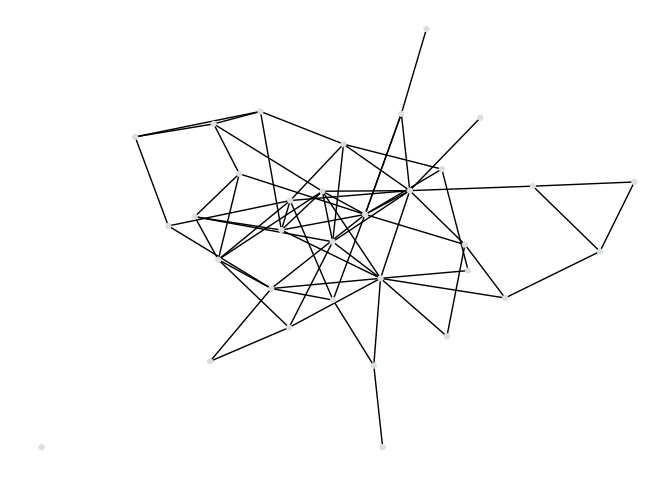<!-- -->

``` r
plot(gof(model3))
```

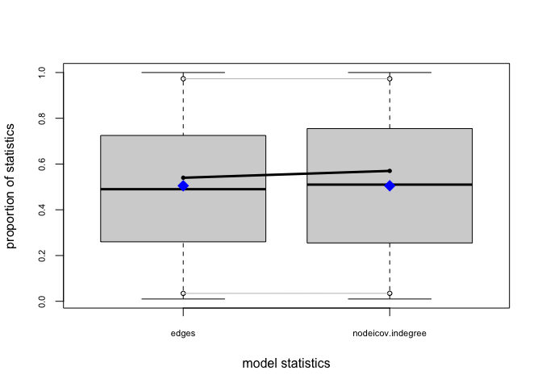<!-- -->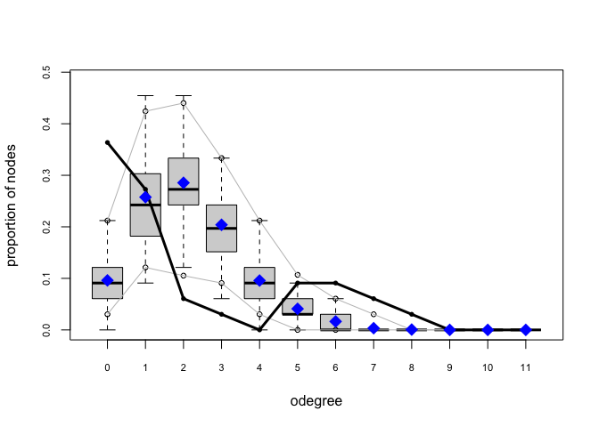<!-- -->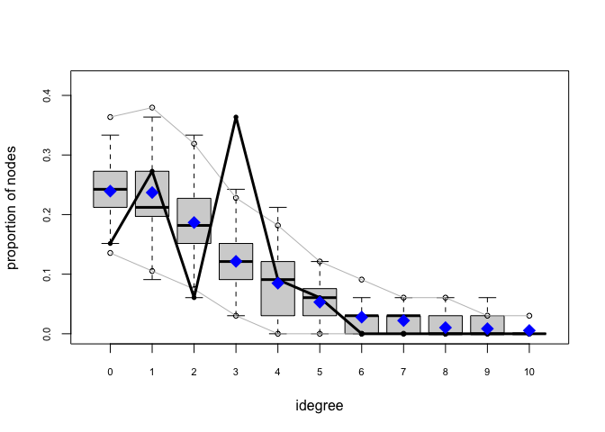<!-- -->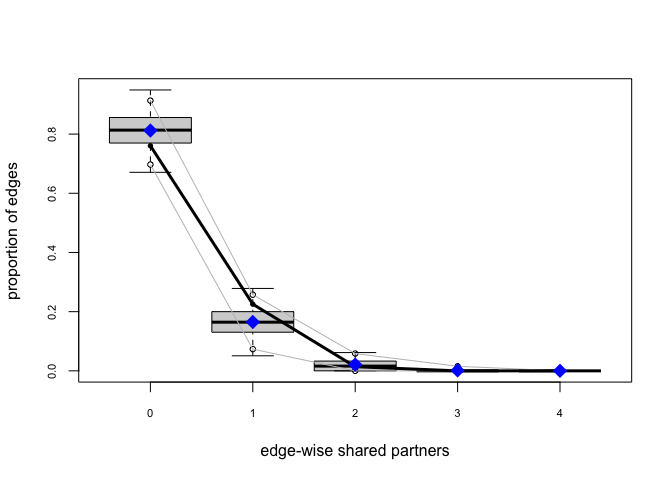<!-- -->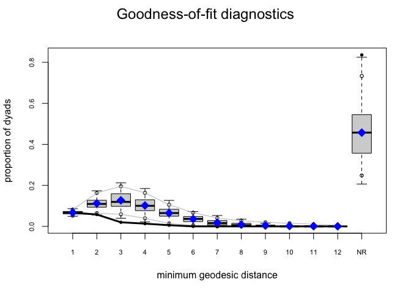<!-- -->

Adding Transitivity

``` r
model4 <- ergm(net_sna ~ edges + nodeicov("indegree") + gwesp, 
                 control = control.ergm(MCMLE.maxit=10))
```

    ## Starting maximum pseudolikelihood estimation (MPLE):

    ## Obtaining the responsible dyads.

    ## Evaluating the predictor and response matrix.

    ## Maximizing the pseudolikelihood.

    ## Finished MPLE.

    ## Starting Monte Carlo maximum likelihood estimation (MCMLE):

    ## Iteration 1 of at most 10:

    ## Optimizing with step length 1.0000.

    ## The log-likelihood improved by < 0.0001.

    ## Estimating equations are not within tolerance region.

    ## Iteration 2 of at most 10:

    ## Optimizing with step length 1.0000.

    ## The log-likelihood improved by < 0.0001.

    ## Estimating equations are not within tolerance region.

    ## Iteration 3 of at most 10:

    ## Optimizing with step length 1.0000.

    ## The log-likelihood improved by < 0.0001.

    ## Estimating equations are not within tolerance region.

    ## Iteration 4 of at most 10:

    ## Optimizing with step length 1.0000.

    ## The log-likelihood improved by < 0.0001.

    ## Estimating equations are not within tolerance region.

    ## Iteration 5 of at most 10:

    ## Optimizing with step length 1.0000.

    ## The log-likelihood improved by < 0.0001.

    ## Estimating equations are not within tolerance region.

    ## Estimating equations did not move closer to tolerance region more than 1 time(s) in 4 steps; increasing sample size.

    ## Iteration 6 of at most 10:

    ## Optimizing with step length 1.0000.

    ## The log-likelihood improved by < 0.0001.

    ## Estimating equations are not within tolerance region.

    ## Iteration 7 of at most 10:

    ## Optimizing with step length 1.0000.

    ## The log-likelihood improved by < 0.0001.

    ## Estimating equations are not within tolerance region.

    ## Iteration 8 of at most 10:

    ## Optimizing with step length 1.0000.

    ## The log-likelihood improved by < 0.0001.

    ## Estimating equations are not within tolerance region.

    ## Estimating equations did not move closer to tolerance region more than 1 time(s) in 4 steps; increasing sample size.

    ## Iteration 9 of at most 10:

    ## Optimizing with step length 1.0000.

    ## The log-likelihood improved by < 0.0001.

    ## Estimating equations are not within tolerance region.

    ## Iteration 10 of at most 10:

    ## Optimizing with step length 1.0000.

    ## The log-likelihood improved by < 0.0001.

    ## Estimating equations are not within tolerance region.

    ## MCMLE estimation did not converge after 10 iterations. The estimated coefficients may not be accurate. Estimation may be resumed by passing the coefficients as initial values; see 'init' under ?control.ergm for details.

    ## Finished MCMLE.

    ## Evaluating log-likelihood at the estimate. Fitting the dyad-independent submodel...
    ## Bridging between the dyad-independent submodel and the full model...
    ## Setting up bridge sampling...
    ## Using 16 bridges: 1 2 3 4 5 6 7 8 9 10 11 12 13 14 15 16 .
    ## Bridging finished.
    ## 
    ## This model was fit using MCMC.  To examine model diagnostics and check
    ## for degeneracy, use the mcmc.diagnostics() function.

``` r
summary(model4)
```

    ## Call:
    ## ergm(formula = net_sna ~ edges + nodeicov("indegree") + gwesp, 
    ##     control = control.ergm(MCMLE.maxit = 10))
    ## 
    ## Monte Carlo Maximum Likelihood Results:
    ## 
    ##                     Estimate Std. Error MCMC % z value Pr(>|z|)    
    ## edges             -4.121e+00  3.055e-01      0 -13.490   <1e-04 ***
    ## nodeicov.indegree  5.123e-01  9.604e-02      0   5.335   <1e-04 ***
    ## gwesp.OTP          3.189e-01  2.744e-01      0   1.162    0.245    
    ## gwesp.OTP.decay    5.339e-15  1.892e+00      0   0.000    1.000    
    ## ---
    ## Signif. codes:  0 '***' 0.001 '**' 0.01 '*' 0.05 '.' 0.1 ' ' 1
    ## 
    ##      Null Deviance: 1464  on 1056  degrees of freedom
    ##  Residual Deviance:  483  on 1052  degrees of freedom
    ##  
    ## AIC: 491  BIC: 510.8  (Smaller is better. MC Std. Err. = 0.1474)

``` r
plogis(coef(model4)[['edges']] + coef(model4)[['nodeicov.indegree']] + 
  coef(model4)[['gwesp.OTP']] + coef(model4)[['gwesp.OTP.decay']])
```

    ## [1] 0.03593552

``` r
set.seed(123)

ergm4 <- simulate(model4)

ggraph(ergm4) +
  geom_edge_link0(color = "black") +
  geom_node_point(color = "#DFE6EB") +
  ggnetwork::theme_blank()
```

    ## Using "stress" as default layout

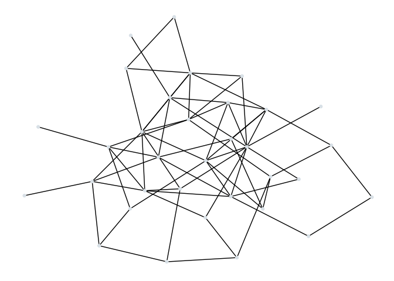<!-- -->

``` r
plot(gof(model4))
```

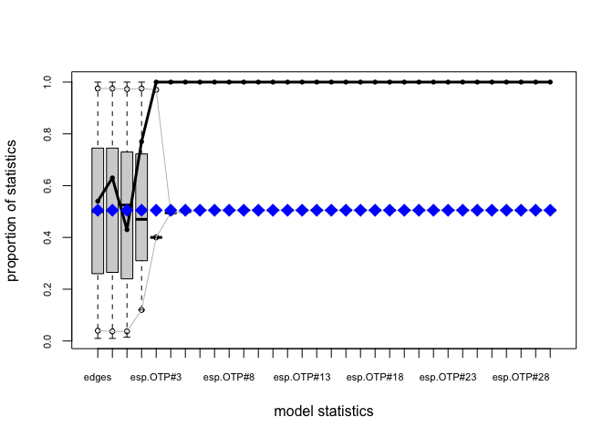<!-- -->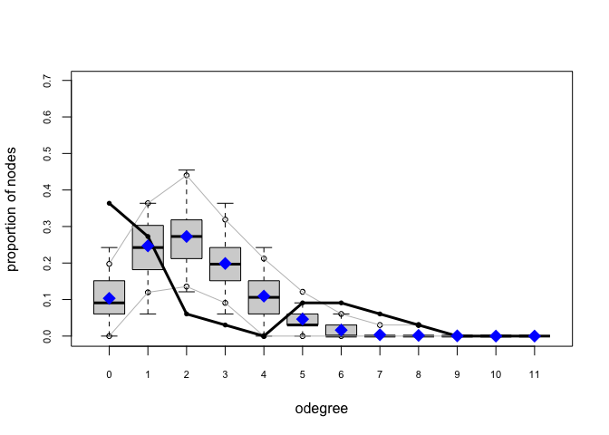<!-- -->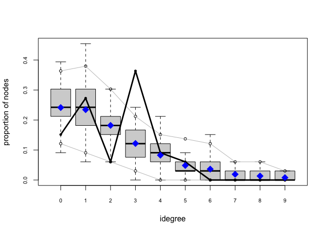<!-- -->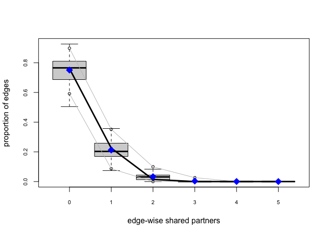<!-- -->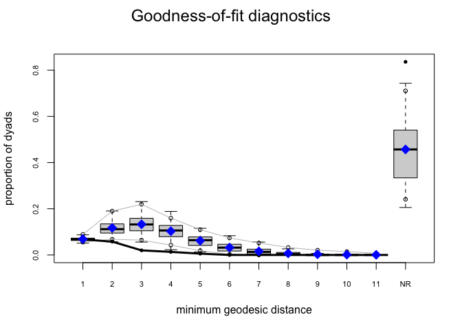<!-- -->
