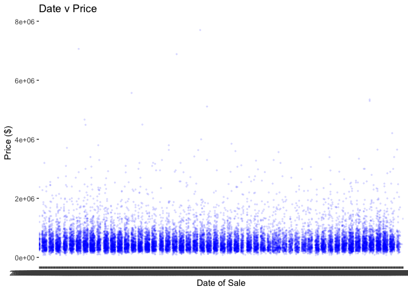
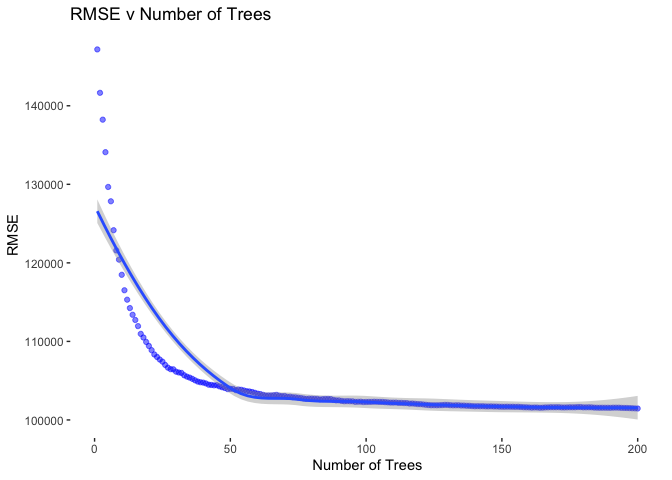

House Data Project
================
2022-09-21

Load the data:

``` r
house_data <- read.csv("kc_house_data.csv")
```

Here is what we know about the variables: id - Unique ID for each home
sold date - Date of the home sale price - Price of each home sold
bedrooms - Number of bedrooms bathrooms - Number of bathrooms, where .5
accounts for a room with a toilet but no shower sqft_living - Square
footage of the apartments interior living space sqft_lot - Square
footage of the land space floors - Number of floors waterfront - A dummy
variable for whether the apartment was overlooking the waterfront or not
view - An index from 0 to 4 of how good the view of the property was
condition - An index from 1 to 5 on the condition of the apartment
grade - An index from 1 to 13, where 1-3 falls short of building
construction and design, 7 has an average level of construction and
design, and 11-13 have a high quality level of construction and design.
sqft_above - The square footage of the interior housing space that is
above ground level sqft_basement - The square footage of the interior
housing space that is below ground level yr_built - The year the house
was initially built yr_renovated - The year of the house’s last
renovation zipcode - What zipcode area the house is in lat - Latitude
long - Longitude sqft_living15 - The square footage of interior housing
living space for the nearest 15 neighbors sqft_lot15 - The square
footage of the land lots of the nearest 15 neighbors

Summary of the data set:

``` r
summary(house_data)
```

    ##        id                date               price            bedrooms     
    ##  Min.   :1.000e+06   Length:21613       Min.   :  75000   Min.   : 0.000  
    ##  1st Qu.:2.123e+09   Class :character   1st Qu.: 321950   1st Qu.: 3.000  
    ##  Median :3.905e+09   Mode  :character   Median : 450000   Median : 3.000  
    ##  Mean   :4.580e+09                      Mean   : 540088   Mean   : 3.371  
    ##  3rd Qu.:7.309e+09                      3rd Qu.: 645000   3rd Qu.: 4.000  
    ##  Max.   :9.900e+09                      Max.   :7700000   Max.   :33.000  
    ##    bathrooms      sqft_living       sqft_lot           floors     
    ##  Min.   :0.000   Min.   :  290   Min.   :    520   Min.   :1.000  
    ##  1st Qu.:1.750   1st Qu.: 1427   1st Qu.:   5040   1st Qu.:1.000  
    ##  Median :2.250   Median : 1910   Median :   7618   Median :1.500  
    ##  Mean   :2.115   Mean   : 2080   Mean   :  15107   Mean   :1.494  
    ##  3rd Qu.:2.500   3rd Qu.: 2550   3rd Qu.:  10688   3rd Qu.:2.000  
    ##  Max.   :8.000   Max.   :13540   Max.   :1651359   Max.   :3.500  
    ##    waterfront            view          condition         grade       
    ##  Min.   :0.000000   Min.   :0.0000   Min.   :1.000   Min.   : 1.000  
    ##  1st Qu.:0.000000   1st Qu.:0.0000   1st Qu.:3.000   1st Qu.: 7.000  
    ##  Median :0.000000   Median :0.0000   Median :3.000   Median : 7.000  
    ##  Mean   :0.007542   Mean   :0.2343   Mean   :3.409   Mean   : 7.657  
    ##  3rd Qu.:0.000000   3rd Qu.:0.0000   3rd Qu.:4.000   3rd Qu.: 8.000  
    ##  Max.   :1.000000   Max.   :4.0000   Max.   :5.000   Max.   :13.000  
    ##    sqft_above   sqft_basement       yr_built     yr_renovated   
    ##  Min.   : 290   Min.   :   0.0   Min.   :1900   Min.   :   0.0  
    ##  1st Qu.:1190   1st Qu.:   0.0   1st Qu.:1951   1st Qu.:   0.0  
    ##  Median :1560   Median :   0.0   Median :1975   Median :   0.0  
    ##  Mean   :1788   Mean   : 291.5   Mean   :1971   Mean   :  84.4  
    ##  3rd Qu.:2210   3rd Qu.: 560.0   3rd Qu.:1997   3rd Qu.:   0.0  
    ##  Max.   :9410   Max.   :4820.0   Max.   :2015   Max.   :2015.0  
    ##     zipcode           lat             long        sqft_living15 
    ##  Min.   :98001   Min.   :47.16   Min.   :-122.5   Min.   : 399  
    ##  1st Qu.:98033   1st Qu.:47.47   1st Qu.:-122.3   1st Qu.:1490  
    ##  Median :98065   Median :47.57   Median :-122.2   Median :1840  
    ##  Mean   :98078   Mean   :47.56   Mean   :-122.2   Mean   :1987  
    ##  3rd Qu.:98118   3rd Qu.:47.68   3rd Qu.:-122.1   3rd Qu.:2360  
    ##  Max.   :98199   Max.   :47.78   Max.   :-121.3   Max.   :6210  
    ##    sqft_lot15    
    ##  Min.   :   651  
    ##  1st Qu.:  5100  
    ##  Median :  7620  
    ##  Mean   : 12768  
    ##  3rd Qu.: 10083  
    ##  Max.   :871200

``` r
dim(house_data)
```

    ## [1] 21613    21

Load the ggplot library:

``` r
library(ggplot2)
```

``` r
ggplot(house_data,
              aes(y = price,
                  x = date)) +
  geom_point(color = "blue", alpha = 0.1, size = 0.5) +
  theme_bw() +
  theme(panel.grid.major = element_blank(),
        panel.grid.minor = element_blank(),
        panel.border = element_blank(),
        panel.background = element_blank()) +
  labs(y = "Price ($)",
       x = "Date of Sale",
       title = "Date v Price")
```

<!-- -->

Create a visualization:

``` r
options(scipen = 999999)
g_1 <- ggplot(house_data,
              aes(y = price,
                  x = sqft_living)) +
  geom_point(color = "blue", alpha = 0.1, size = 0.5) +
  theme_bw() +
  geom_smooth(method = "lm") +
  theme(panel.grid.major = element_blank(),
        panel.grid.minor = element_blank(),
        panel.border = element_blank(),
        panel.background = element_blank()) +
  labs(y = "Price ($)",
       x = "Living Space (square ft)",
       title = "Living Space v Price")

g_1
```

    ## `geom_smooth()` using formula = 'y ~ x'

<!-- -->

Visualization 2:

``` r
g_2 <- ggplot(house_data,
              aes(y = price,
                  x = factor(bathrooms))) +
  geom_boxplot(color = "red", alpha = 0.3) + 
  theme_bw() + 
  theme(panel.grid.major = element_blank(), 
        panel.grid.minor = element_blank(),
        panel.border = element_blank(),
        panel.background = element_blank()) +
  labs(y = "Price", 
       x = "Number of Bathrooms",
       title = "Price v Bathrooms")

g_2
```

<!-- -->

Visualization 3:

``` r
g_3 <- ggplot(house_data, aes(x = price)) +
  geom_density(fill = "blue", alpha = 0.3) +
  theme_bw() +
  theme(panel.grid.major = element_blank(),
        panel.grid.minor = element_blank(),
        panel.border = element_blank(),
        panel.background = element_blank()) +
  labs(x = "Price",
       title = "Density plot of Price")

g_3
```

<!-- -->

Visualization 4:

``` r
library(OneR) #so we can use the bin() function because there are so many years
```

``` r
t_bins <- bin(house_data$yr_built, nbins = 8, method = "length")

g_4 <- ggplot(house_data,
              aes(y = price,
                  x = t_bins)) +
  geom_point(color = "blue", alpha = 0.3) + 
  theme_bw() + 
  theme(panel.grid.major = element_blank(), 
        panel.grid.minor = element_blank(),
        panel.border = element_blank(),
        panel.background = element_blank()) +
  labs(y = "Price", 
       x = "Year Built",
       title = "Price vs Year Built")

g_4
```

<!-- -->

Log-adjusted price distribution

``` r
ggplot(house_data, aes(x = log(price))) +
  geom_density(fill = "blue", alpha = 0.3) +
  theme_bw() +
  theme(panel.grid.major = element_blank(),
        panel.grid.minor = element_blank(),
        panel.border = element_blank(),
        panel.background = element_blank()) +
  labs(x = "Log(Price)",
       title = "Density plot of Log(Price)")
```

<!-- -->

Distribution of Latitude

``` r
g_lat <- ggplot(house_data, aes(x = lat)) +
  geom_density(fill = "blue", alpha = 0.3) +
  theme_bw() +
  theme(panel.grid.major = element_blank(),
        panel.grid.minor = element_blank(),
        panel.border = element_blank(),
        panel.background = element_blank()) +
  labs(x = "Latitude",
       title = "Density plot of Latitudes")

g_lat
```

<!-- -->

Distribution of Longitude

``` r
g_lon <- ggplot(house_data, aes(x = long)) +
  geom_density(fill = "blue", alpha = 0.3) +
  theme_bw() +
  theme(panel.grid.major = element_blank(),
        panel.grid.minor = element_blank(),
        panel.border = element_blank(),
        panel.background = element_blank()) +
  labs(x = "Longitude",
       title = "Density plot of Longitudes")

g_lon
```

<!-- -->

## Split data into Training and Test

``` r
RNGkind(sample.kind="Rounding")
```

    ## Warning in RNGkind(sample.kind = "Rounding"): non-uniform 'Rounding' sampler
    ## used

``` r
set.seed(725385) #seed number from random number generator on Google

train <- sample(c(1:dim(house_data)[1]), dim(house_data)[1]*.8)
train_data <- house_data[train,]
test_data <- house_data[-train,]
```

## Single Tree Model to compare to

``` r
library(rpart)
single_tree <- rpart(price ~.,
                data = train_data[,3:21])
```

``` r
#install.packages("Metrics")
library(Metrics)
```

``` r
single_tree_pred <- predict(single_tree, test_data)
rmse(single_tree_pred, test_data$price)
```

    ## [1] 215936.3

RMSE of \$215,936.30 is not good.

## Ensemble Tree Models - Bagging

``` r
library(randomForest)
```

    ## randomForest 4.7-1.1

    ## Type rfNews() to see new features/changes/bug fixes.

    ## 
    ## Attaching package: 'randomForest'

    ## The following object is masked from 'package:ggplot2':
    ## 
    ##     margin

We will exclude ID because it will have no predictive value, and exclude
date because all sales are within a year so it is unlikely to be
significant

``` r
set.seed(725385) #seed number from random number generator on Google

bag_mod <- randomForest(price ~.,
                data = train_data[,3:21],
                mtry = 18, # Set mtry to number of variables 
                ntree = 200)
bag_mod
```

    ## 
    ## Call:
    ##  randomForest(formula = price ~ ., data = train_data[, 3:21],      mtry = 18, ntree = 200) 
    ##                Type of random forest: regression
    ##                      Number of trees: 200
    ## No. of variables tried at each split: 18
    ## 
    ##           Mean of squared residuals: 16349835487
    ##                     % Var explained: 87.83

87.83% variation explained is pretty good

Predict using bagging model and get the RMSE:

``` r
bag_preds <- predict(bag_mod, test_data)
rmse(bag_preds, test_data$price)
```

    ## [1] 132982.5

This is not a very accurate model. \$132,982.50 root mean square error
on predictions of test data.

Let’s take a look at the RMSE

``` r
RMSE <- sqrt(bag_mod$mse) # Extract MSE
plot_dat <- cbind.data.frame(rep(1:length(RMSE)), RMSE) # Create plot data
names(plot_dat) <- c("trees", "RMSE") # Name plot data

# Plot oob error
g_5 <- ggplot(plot_dat, aes(x = trees, y = RMSE)) + # Set x as trees and y as error
  geom_point(alpha = 0.5, color = "blue") + # Select geom point
  geom_smooth() + # Add smoothing line
  theme_bw() + # Set theme
  theme(panel.grid.major = element_blank(), # Remove grid
        panel.grid.minor = element_blank(), # Remove grid
        panel.border = element_blank(), # Remove grid
        panel.background = element_blank()) + # Remove grid 
  labs(x = "Number of Trees", title = "RMSE v Number of Trees",
       y = "RMSE")  # Set labels
g_5 # Print plot
```

    ## `geom_smooth()` using method = 'loess' and formula = 'y ~ x'

<!-- -->
It appears 200 trees was more than enough since the MSE evened out after
about 70 trees.

Let’s tune this model.

``` r
trees <- c(25, 50, 100, 200) # Create vector of possible tree sizes
nodesize <- c(1, 10, 25, 50, 100) # Create vector of possible node sizes

params <- expand.grid(trees, nodesize) # Expand grid to get data frame of parameter combinations
names(params) <- c("trees", "nodesize") # Name parameter data frame
res_vec <- rep(NA, nrow(params)) # Create vector to store accuracy results

for(i in 1:nrow(params)){ # For each set of parameters
  set.seed(725385) # Set seed for reproducability
  mod <- randomForest(price ~. , # Set formula
                      data=train_data[,3:21],# Set data
                      mtry = 18, # Set number of variables
                      importance = FALSE,
                      ntree = params$trees[i], # Set number of trees
                      nodesize = params$nodesize[i]) # Set node size
  res_vec[i] <- mod$mse[length(mod$mse)] # MSE values
}
```

``` r
summary(res_vec)
```

    ##        Min.     1st Qu.      Median        Mean     3rd Qu.        Max. 
    ## 16281898218 16808070451 18077557091 18030103011 18814957493 20395863453

``` r
RMSE <- sqrt(res_vec)
summary(RMSE)
```

    ##    Min. 1st Qu.  Median    Mean 3rd Qu.    Max. 
    ##  127601  129646  134453  134196  137166  142814

``` r
res_db <- cbind.data.frame(params, RMSE) # Join parameters and accuracy results
names(res_db)[3] <- "RMSE" # Name accuracy results column
res_db
```

    ##    trees nodesize     RMSE
    ## 1     25        1 134664.1
    ## 2     50        1 131447.2
    ## 3    100        1 129149.2
    ## 4    200        1 127600.5
    ## 5     25       10 134340.4
    ## 6     50       10 132249.4
    ## 7    100       10 129503.6
    ## 8    200       10 128063.0
    ## 9     25       25 136113.7
    ## 10    50       25 131150.4
    ## 11   100       25 129693.4
    ## 12   200       25 129022.5
    ## 13    25       50 138251.6
    ## 14    50       50 136804.4
    ## 15   100       50 136413.4
    ## 16   200       50 134565.2
    ## 17    25      100 142814.1
    ## 18    50      100 140998.2
    ## 19   100      100 140869.9
    ## 20   200      100 140209.7

``` r
res_db$trees <- as.factor(res_db$trees) # Convert tree number to factor for plotting
res_db$nodesize <- as.factor(res_db$nodesize) # Convert node size to factor for plotting
g_6 <- ggplot(res_db, aes(y = trees, x = nodesize, fill = RMSE)) + # set aesthetics
  geom_tile() + # Use geom_tile for heatmap
  theme_bw() + # Set theme
  scale_fill_gradient2(low = "blue", # Choose low color
    mid = "white", # Choose mid color
    high = "red", # Choose high color
    midpoint = mean(res_db$RMSE), # Choose mid point
    space = "Lab", 
    na.value ="grey", # Choose NA value
    guide = "colourbar", # Set color bar
    aesthetics = "fill") + # Select aesthetics to apply
  labs(x = "Node Size", y = "Number of Trees", fill = "RMSE") # Set labels
g_6 # Generate plot
```

<!-- -->

``` r
res_db[which.min(res_db$RMSE),]
```

    ##   trees nodesize     RMSE
    ## 4   200        1 127600.5

Let’s remove house prices over \$2,000,000

``` r
set.seed(725385) #seed number from random number generator on Google
train_no_outlier <- train_data[train_data$price < 2000000,]
bag_mod2 <- randomForest(price ~.,
                data = train_no_outlier[,3:21],
                mtry = 18,
                ntree = 200)
bag_mod2
```

    ## 
    ## Call:
    ##  randomForest(formula = price ~ ., data = train_no_outlier[, 3:21],      mtry = 18, ntree = 200) 
    ##                Type of random forest: regression
    ##                      Number of trees: 200
    ## No. of variables tried at each split: 18
    ## 
    ##           Mean of squared residuals: 10293555855
    ##                     % Var explained: 87.37

``` r
bag_preds2 <- predict(bag_mod2, test_data)
rmse(bag_preds2, test_data$price)
```

    ## [1] 165828.2

``` r
RMSE2 <- sqrt(bag_mod2$mse) # Extract MSE
plot_dat2 <- cbind.data.frame(rep(1:length(RMSE2)), RMSE2) # Create plot data
names(plot_dat2) <- c("trees", "RMSE") # Name plot data

# Plot oob error
g_7 <- ggplot(plot_dat2, aes(x = trees, y = RMSE)) + # Set x as trees and y as error
  geom_point(alpha = 0.5, color = "blue") + # Select geom point
  geom_smooth() + # Add smoothing line
  theme_bw() + # Set theme
  theme(panel.grid.major = element_blank(), # Remove grid
        panel.grid.minor = element_blank(), # Remove grid
        panel.border = element_blank(), # Remove grid
        panel.background = element_blank()) + # Remove grid 
  labs(x = "Number of Trees", title = "RMSE v Number of Trees",
       y = "RMSE")  # Set labels
g_7 # Print plot
```

    ## `geom_smooth()` using method = 'loess' and formula = 'y ~ x'

<!-- -->
This made the predictive power of the model worse.

## Cross-Validated Bagging Model

``` r
set.seed(725385)
# Create cross-validation index
cv_ind <- sample(1:5, nrow(train_data), replace = TRUE )

# Create accuracy store
cv_RMSE <- rep(NA, 5)
for(i in 1:5){ # For 1 to 5
  cv_train <- train_data[cv_ind != i ,c(3:21)] # Create training data
  cv_test <- train_data[cv_ind == i,  c(3:21)] # Create test data

  bag_mod_3 <- randomForest(price ~., # Set tree formula
                data = cv_train, # Set dataset
                mtry = 18, # set number of variables to use
                ntree = 200, # Set number of trees to generate
                nodesize = 1) # Set node size
  bag_preds_3 <- predict(bag_mod_3, cv_test) # Create test data predictions

  rmse <- rmse(bag_preds_3, cv_test$price)
  cv_RMSE[i] <- rmse # RMSE values
}

# Print cross validated accuracy scores
cv_RMSE
```

    ## [1] 140165.4 118858.7 120393.5 137092.5 120177.5

``` r
mean(cv_RMSE)
```

    ## [1] 127337.5

This is a slight improvement from the original bagging model RMSE of
132,982.50 to 127,337.50 for the cross-validated model, however, 127,000
is still a lot of error. This is still a large improvement from the
215,936.30 RMSE of the single tree model.

## Important Variables

``` r
varImpPlot(bag_mod, type =2, n.var = 10)
```

<!-- -->

``` r
varImpPlot(bag_mod2, type =2, n.var = 10)
```

<!-- -->

``` r
varImpPlot(bag_mod_3, type =2, n.var = 10)
```

<!-- -->

## Ensemble Tree Models - Bagging with log(price)

``` r
set.seed(725385) #seed number from random number generator on Google

bag_mod_log <- randomForest(log(price) ~.,
                data = train_data[,3:21],
                mtry = 18, 
                ntree = 200)
bag_mod_log
```

    ## 
    ## Call:
    ##  randomForest(formula = log(price) ~ ., data = train_data[, 3:21],      mtry = 18, ntree = 200) 
    ##                Type of random forest: regression
    ##                      Number of trees: 200
    ## No. of variables tried at each split: 18
    ## 
    ##           Mean of squared residuals: 0.03184348
    ##                     % Var explained: 88.41

88.41% variation explained is pretty good

Predict using bagging model and get the RMSE:

``` r
bag_preds_log <- predict(bag_mod_log, test_data)
preds_log_adj <- exp(bag_preds_log)
rmse(preds_log_adj, test_data$price)
```

    ## [1] 127769.1

This is not a very accurate model. \$127,769.1 root mean square error on
predictions of test data. This is a slightly better model than the
original ensemble.

## Log-adjusted ensemble using parameters from before

``` r
mod_log <- randomForest(log(price) ~. ,
                      data=train_data[,3:21],
                      mtry = 18,
                      importance = FALSE,
                      ntree = 200,
                      nodesize = 1)
mod_log
```

    ## 
    ## Call:
    ##  randomForest(formula = log(price) ~ ., data = train_data[, 3:21],      mtry = 18, importance = FALSE, ntree = 200, nodesize = 1) 
    ##                Type of random forest: regression
    ##                      Number of trees: 200
    ## No. of variables tried at each split: 18
    ## 
    ##           Mean of squared residuals: 0.03196423
    ##                     % Var explained: 88.36

88.39% variation explained is slightly worse than the first log-adjusted
model.

Predict using bagging model and get the RMSE:

``` r
bag_preds_log2 <- predict(mod_log, test_data)
preds_log_adj2 <- exp(bag_preds_log2)
rmse(preds_log_adj2, test_data$price)
```

    ## [1] 128462.6

129,419.50 RMSE is worse than the previous 2 models

``` r
varImpPlot(bag_mod_log, type =2, n.var = 10)
```

<!-- -->

``` r
varImpPlot(mod_log, type =2, n.var = 10)
```

<!-- -->

## Refined Variables

Lastly, lets try removing latitude and longitude since they are very
important but are almost the same for each house since the houses are
all in the same general area

``` r
train_data_2 <- train_data[,-c(18:19)]
test_data_2 <- test_data[,-c(18:19)]
```

``` r
mod_no_lat_lon <- randomForest(price ~. ,
                      data=train_data_2[,3:19],# Set data
                      mtry = 16, # Set number of variables
                      importance = FALSE,
                      ntree = 200, # Set number of trees
                      nodesize = 1) # Set node size
```

Predict using bagging model and get the RMSE:

``` r
bag_preds_no_lat_lon <- predict(mod_no_lat_lon, test_data_2)
rmse(bag_preds_no_lat_lon, test_data_2$price)
```

    ## [1] 152536.1

This model became much worse without latitude and longitude included,
indicating that differences of just a few miles can have strong impacts
on the prices of homes.
