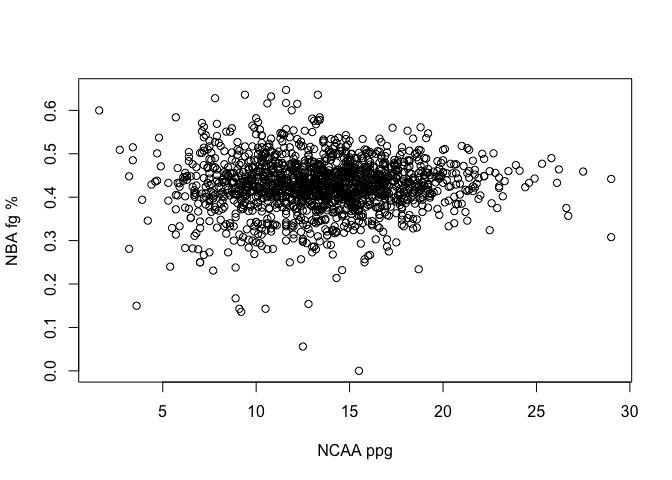
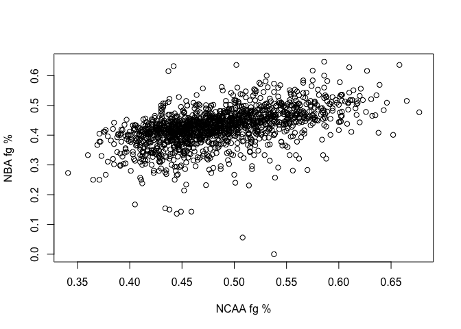
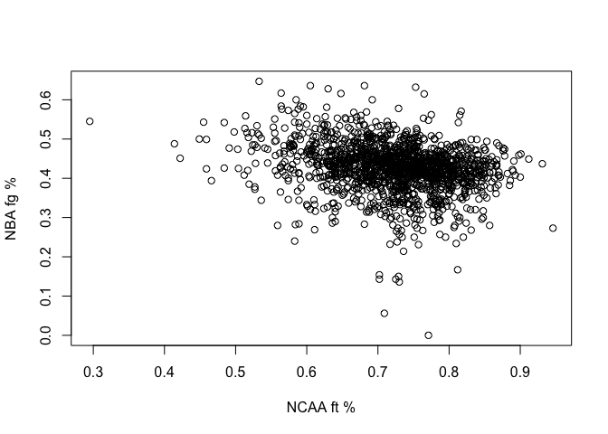
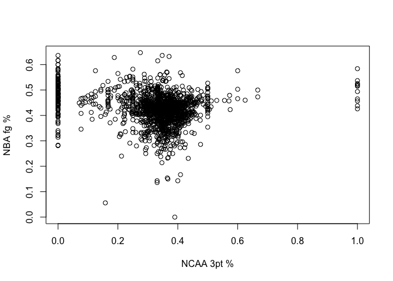
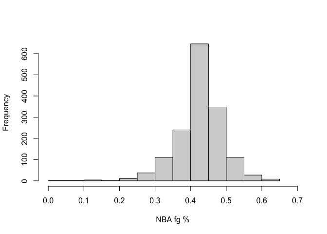
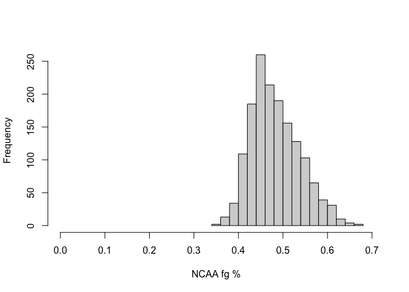
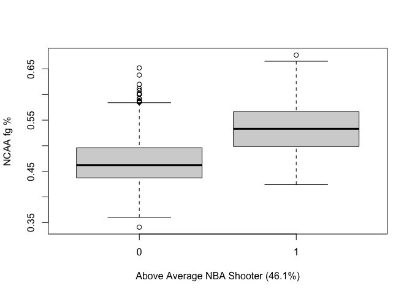
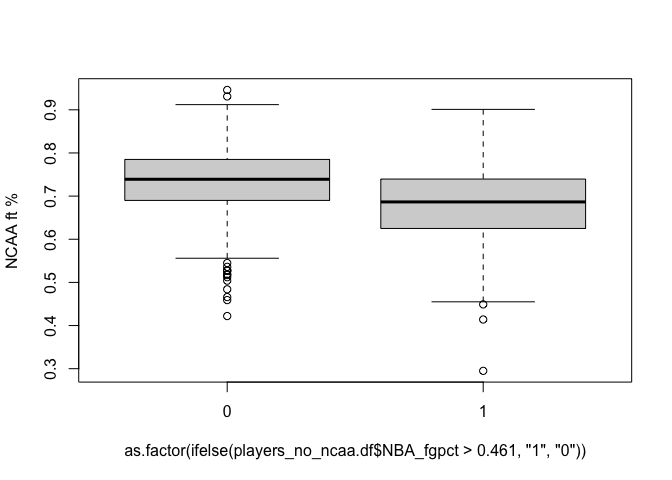

NBA Performance
================
2022-04-25

Load the data

``` r
players.df <- read.csv("players.csv")
head(players.df)
```

    ##   X active_from active_to        birth_date
    ## 1 0        1991      1995     June 24, 1968
    ## 2 1        1969      1978     April 7, 1946
    ## 3 2        1970      1989    April 16, 1947
    ## 4 3        1991      2001     March 9, 1969
    ## 5 4        1998      2003  November 3, 1974
    ## 6 5        1997      2008 December 11, 1976
    ##                                             college height                name
    ## 1                                   Duke University   6-10      Alaa Abdelnaby
    ## 2                             Iowa State University    6-9     Zaid Abdul-Aziz
    ## 3             University of California, Los Angeles    7-2 Kareem Abdul-Jabbar
    ## 4                        Louisiana State University    6-1  Mahmoud Abdul-Rauf
    ## 5 University of Michigan, San Jose State University    6-6   Tariq Abdul-Wahad
    ## 6                          University of California    6-9 Shareef Abdur-Rahim
    ##   position                       url weight NBA__3ptapg NBA__3ptpct NBA__3ptpg
    ## 1      F-C /players/a/abdelal01.html    240         0.0       0.000        0.0
    ## 2      C-F /players/a/abdulza01.html    235          NA          NA         NA
    ## 3        C /players/a/abdulka01.html    225         0.0       0.056        0.0
    ## 4        G /players/a/abdulma02.html    162         2.3       0.354        0.8
    ## 5        F /players/a/abdulta01.html    223         0.3       0.237        0.1
    ## 6        F /players/a/abdursh01.html    225         0.6       0.297        0.2
    ##   NBA_efgpct NBA_fg. NBA_fg_per_game NBA_fga_per_game NBA_ft. NBA_ft_per_g
    ## 1      0.502   0.502             2.4              4.8   0.701          0.9
    ## 2         NA   0.428             3.5              8.2   0.728          2.0
    ## 3      0.559   0.559            10.2             18.1   0.721          4.3
    ## 4      0.472   0.442             6.0             13.6   0.905          1.8
    ## 5      0.422   0.417             3.1              7.3   0.703          1.6
    ## 6      0.479   0.472             6.5             13.9   0.810          4.8
    ##   NBA_fta_p_g NBA_g_played NBA_ppg NCAA__3ptapg NCAA__3ptpct NCAA__3ptpg
    ## 1         1.3          256     5.7          0.0           NA         0.0
    ## 2         2.8          505     9.0           NA           NA          NA
    ## 3         6.0         1560    24.6           NA           NA          NA
    ## 4         2.0          586    14.6          7.2        0.372         2.7
    ## 5         2.2          236     7.8           NA           NA          NA
    ## 6         6.0          830    18.1          0.8        0.381         0.3
    ##   NCAA_efgpct NCAA_fgapg NCAA_fgpct NCAA_fgpg NCAA_ft NCAA_ftapg NCAA_ftpg
    ## 1          NA        5.6      0.599       3.3   0.728        2.5       1.8
    ## 2          NA         NA         NA        NA      NA         NA        NA
    ## 3          NA       16.8      0.639      10.7   0.628        7.9       5.0
    ## 4          NA       21.9      0.474      10.4   0.863        6.4       5.5
    ## 5          NA         NA         NA        NA      NA         NA        NA
    ## 6          NA       14.2      0.518       7.4   0.683        8.9       6.1
    ##   NCAA_games NCAA_ppg
    ## 1        134      8.5
    ## 2         NA       NA
    ## 3         88     26.4
    ## 4         64     29.0
    ## 5         NA       NA
    ## 6         28     21.1

``` r
dim(players.df)
```

    ## [1] 4576   34

Remove the one player with no position or stats

``` r
players.df <- players.df[-which(players.df$position == ""),]
dim(players.df)
```

    ## [1] 4575   34

``` r
head(players.df)
```

    ##   X active_from active_to        birth_date
    ## 1 0        1991      1995     June 24, 1968
    ## 2 1        1969      1978     April 7, 1946
    ## 3 2        1970      1989    April 16, 1947
    ## 4 3        1991      2001     March 9, 1969
    ## 5 4        1998      2003  November 3, 1974
    ## 6 5        1997      2008 December 11, 1976
    ##                                             college height                name
    ## 1                                   Duke University   6-10      Alaa Abdelnaby
    ## 2                             Iowa State University    6-9     Zaid Abdul-Aziz
    ## 3             University of California, Los Angeles    7-2 Kareem Abdul-Jabbar
    ## 4                        Louisiana State University    6-1  Mahmoud Abdul-Rauf
    ## 5 University of Michigan, San Jose State University    6-6   Tariq Abdul-Wahad
    ## 6                          University of California    6-9 Shareef Abdur-Rahim
    ##   position                       url weight NBA__3ptapg NBA__3ptpct NBA__3ptpg
    ## 1      F-C /players/a/abdelal01.html    240         0.0       0.000        0.0
    ## 2      C-F /players/a/abdulza01.html    235          NA          NA         NA
    ## 3        C /players/a/abdulka01.html    225         0.0       0.056        0.0
    ## 4        G /players/a/abdulma02.html    162         2.3       0.354        0.8
    ## 5        F /players/a/abdulta01.html    223         0.3       0.237        0.1
    ## 6        F /players/a/abdursh01.html    225         0.6       0.297        0.2
    ##   NBA_efgpct NBA_fg. NBA_fg_per_game NBA_fga_per_game NBA_ft. NBA_ft_per_g
    ## 1      0.502   0.502             2.4              4.8   0.701          0.9
    ## 2         NA   0.428             3.5              8.2   0.728          2.0
    ## 3      0.559   0.559            10.2             18.1   0.721          4.3
    ## 4      0.472   0.442             6.0             13.6   0.905          1.8
    ## 5      0.422   0.417             3.1              7.3   0.703          1.6
    ## 6      0.479   0.472             6.5             13.9   0.810          4.8
    ##   NBA_fta_p_g NBA_g_played NBA_ppg NCAA__3ptapg NCAA__3ptpct NCAA__3ptpg
    ## 1         1.3          256     5.7          0.0           NA         0.0
    ## 2         2.8          505     9.0           NA           NA          NA
    ## 3         6.0         1560    24.6           NA           NA          NA
    ## 4         2.0          586    14.6          7.2        0.372         2.7
    ## 5         2.2          236     7.8           NA           NA          NA
    ## 6         6.0          830    18.1          0.8        0.381         0.3
    ##   NCAA_efgpct NCAA_fgapg NCAA_fgpct NCAA_fgpg NCAA_ft NCAA_ftapg NCAA_ftpg
    ## 1          NA        5.6      0.599       3.3   0.728        2.5       1.8
    ## 2          NA         NA         NA        NA      NA         NA        NA
    ## 3          NA       16.8      0.639      10.7   0.628        7.9       5.0
    ## 4          NA       21.9      0.474      10.4   0.863        6.4       5.5
    ## 5          NA         NA         NA        NA      NA         NA        NA
    ## 6          NA       14.2      0.518       7.4   0.683        8.9       6.1
    ##   NCAA_games NCAA_ppg
    ## 1        134      8.5
    ## 2         NA       NA
    ## 3         88     26.4
    ## 4         64     29.0
    ## 5         NA       NA
    ## 6         28     21.1

Remove players with no NCAA data

``` r
a <- which(is.na(players.df$NCAA__3ptpct))
b <- which(is.na(players.df$NCAA_ft))
c <- which(is.na(players.df$NCAA_ppg))
no_ncaa <- union(a, union(b, c))
```

New dataframe without missing data

``` r
players_no_ncaa.df <- players.df[-no_ncaa,]
dim(players_no_ncaa.df)
```

    ## [1] 1726   34

Remove players with less than 10 NBA games played

``` r
less_10 <- which(players_no_ncaa.df$NBA_g_played < 10)
players_no_ncaa.df <- players_no_ncaa.df[-less_10,]
dim(players_no_ncaa.df)
```

    ## [1] 1545   34

Make a new dataframe with just NCAA data and NBA fg %

``` r
players_no_ncaa.df <- players_no_ncaa.df[,-c(1,2,3,4,5,6,7,8,9,10,11,12,13,14,16,17,18,19,20,21,22,26)]
dim(players_no_ncaa.df)
```

    ## [1] 1545   12

Rename some of the columns for consistency:

``` r
names(players_no_ncaa.df)[names(players_no_ncaa.df) == "NBA_fg."] <- "NBA_fgpct"
names(players_no_ncaa.df)[names(players_no_ncaa.df) == "NCAA_ft"] <- "NCAA_ftpct"
names(players_no_ncaa.df)[names(players_no_ncaa.df) == "NCAA__3ptpct"] <- "NCAA_3ptpct"
head(players_no_ncaa.df)
```

    ##    NBA_fgpct NCAA__3ptapg NCAA_3ptpct NCAA__3ptpg NCAA_fgapg NCAA_fgpct
    ## 4      0.442          7.2       0.372         2.7       21.9      0.474
    ## 6      0.472          0.8       0.381         0.3       14.2      0.518
    ## 11     0.370          3.3       0.411         1.4       11.2      0.457
    ## 15     0.446          0.1       0.429         0.0        6.0      0.602
    ## 19     0.534          1.9       0.311         0.6       11.6      0.499
    ## 20     0.402          4.3       0.331         1.4       11.6      0.467
    ##    NCAA_fgpg NCAA_ftpct NCAA_ftapg NCAA_ftpg NCAA_games NCAA_ppg
    ## 4       10.4      0.863        6.4       5.5         64     29.0
    ## 6        7.4      0.683        8.9       6.1         28     21.1
    ## 11       5.1      0.823        3.5       2.9         88     14.5
    ## 15       3.6      0.708        3.6       2.5        139      9.8
    ## 19       5.8      0.704        2.7       1.9        130     14.0
    ## 20       5.4      0.839        5.0       4.2         69     16.4

``` r
dim(players_no_ncaa.df)
```

    ## [1] 1545   12

Visualizations used to try to find valuable insights in the data

``` r
plot(players_no_ncaa.df$NBA_fgpct ~ players_no_ncaa.df$NCAA_ppg, xlab = "NCAA ppg", ylab = "NBA fg %")
```

<!-- -->

``` r
plot(players_no_ncaa.df$NBA_fgpct ~ players_no_ncaa.df$NCAA_fgpct, xlab = "NCAA fg %", ylab = "NBA fg %")
```

<!-- -->

``` r
plot(players_no_ncaa.df$NBA_fgpct ~ players_no_ncaa.df$NCAA_ftpct, xlab = "NCAA ft %", ylab = "NBA fg %")
```

<!-- -->

``` r
plot(players_no_ncaa.df$NBA_fgpct ~ players_no_ncaa.df$NCAA_3ptpct,xlab = "NCAA 3pt %", ylab = "NBA fg %")
```

<!-- -->

``` r
hist(players_no_ncaa.df$NBA_fgpct, xlim = c(0,0.7), main = "", xlab = "NBA fg %")
```

<!-- -->

``` r
hist(players_no_ncaa.df$NCAA_fgpct, xlim = c(0,0.7), main = "", xlab = "NCAA fg %")
```

<!-- -->

``` r
# These show comparisons between above and below average NBA shooters and their NCAA statistics
boxplot(players_no_ncaa.df$NCAA_fgpct ~ as.factor(ifelse(players_no_ncaa.df$NBA_fgpct > 0.461, "1", "0")), xlab = "Above Average NBA Shooter (46.1%)", ylab = "NCAA fg %")
```

<!-- -->

``` r
boxplot(players_no_ncaa.df$NCAA_ftpct ~ as.factor(ifelse(players_no_ncaa.df$NBA_fgpct > 0.461, "1", "0")),  ylab = "NCAA ft %")
```

<!-- -->

Partition the data

``` r
RNGkind(sample.kind = "Rounding")
```

    ## Warning in RNGkind(sample.kind = "Rounding"): non-uniform 'Rounding' sampler
    ## used

``` r
set.seed(10)

train.index <- sample(c(1:dim(players_no_ncaa.df)[1]), dim(players_no_ncaa.df)[1]*0.8)  
train.df <- players_no_ncaa.df[train.index, ]
valid.df <- players_no_ncaa.df[-train.index, ]
head(train.df)
```

    ##      NBA_fgpct NCAA__3ptapg NCAA_3ptpct NCAA__3ptpg NCAA_fgapg NCAA_fgpct
    ## 2163     0.502          0.1       0.467         0.1       11.1      0.600
    ## 1307     0.429          3.4       0.388         1.3       11.5      0.523
    ## 1836     0.525          0.0       0.000         0.0        6.6      0.586
    ## 3088     0.370          6.2       0.340         2.1       11.5      0.385
    ## 350      0.409          6.0       0.379         2.3       15.2      0.457
    ## 927      0.442          2.0       0.325         0.6       13.3      0.497
    ##      NCAA_fgpg NCAA_ftpct NCAA_ftapg NCAA_ftpg NCAA_games NCAA_ppg
    ## 2163       6.6      0.736        7.1       5.2        125     18.6
    ## 1307       6.0      0.790        4.6       3.6         34     17.0
    ## 1836       3.9      0.619        4.1       2.5        109     10.3
    ## 3088       4.4      0.737        3.1       2.2        117     13.2
    ## 350        6.9      0.668        2.9       1.9         74     18.1
    ## 927        6.6      0.639        6.3       4.0         58     17.9

``` r
head(valid.df)
```

    ##    NBA_fgpct NCAA__3ptapg NCAA_3ptpct NCAA__3ptpg NCAA_fgapg NCAA_fgpct
    ## 28     0.339          4.3       0.380         1.6        9.6      0.441
    ## 48     0.518          0.0       0.000         0.0       11.5      0.611
    ## 60     0.475          2.2       0.347         0.8       11.5      0.477
    ## 65     0.381          2.9       0.435         1.3       10.5      0.492
    ## 67     0.383          5.9       0.337         2.0        9.4      0.401
    ## 96     0.471          0.0       0.000         0.0       12.7      0.560
    ##    NCAA_fgpg NCAA_ftpct NCAA_ftapg NCAA_ftpg NCAA_games NCAA_ppg
    ## 28       4.2      0.775        3.2       2.5        124     12.5
    ## 48       7.0      0.635        4.8       3.0        111     17.0
    ## 60       5.5      0.682        5.2       3.5         67     15.3
    ## 65       5.2      0.824        4.2       3.5        121     15.1
    ## 67       3.8      0.758        2.0       1.5         33     11.0
    ## 96       7.1      0.802        3.4       2.7         68     16.9

Use exhaustive, forward, backward, step-wise, and PCA to get the best
NCAA predictive variables

Exhaustive Search

``` r
library(leaps)
NCAA_exhaust <- regsubsets(NBA_fgpct ~ ., data = train.df, nbest = 1, nvmax = dim(train.df)[2], method = 'exhaustive')

sum1 <- summary(NCAA_exhaust)
sum1
```

    ## Subset selection object
    ## Call: regsubsets.formula(NBA_fgpct ~ ., data = train.df, nbest = 1, 
    ##     nvmax = dim(train.df)[2], method = "exhaustive")
    ## 11 Variables  (and intercept)
    ##              Forced in Forced out
    ## NCAA__3ptapg     FALSE      FALSE
    ## NCAA_3ptpct      FALSE      FALSE
    ## NCAA__3ptpg      FALSE      FALSE
    ## NCAA_fgapg       FALSE      FALSE
    ## NCAA_fgpct       FALSE      FALSE
    ## NCAA_fgpg        FALSE      FALSE
    ## NCAA_ftpct       FALSE      FALSE
    ## NCAA_ftapg       FALSE      FALSE
    ## NCAA_ftpg        FALSE      FALSE
    ## NCAA_games       FALSE      FALSE
    ## NCAA_ppg         FALSE      FALSE
    ## 1 subsets of each size up to 11
    ## Selection Algorithm: exhaustive
    ##           NCAA__3ptapg NCAA_3ptpct NCAA__3ptpg NCAA_fgapg NCAA_fgpct NCAA_fgpg
    ## 1  ( 1 )  " "          " "         " "         " "        "*"        " "      
    ## 2  ( 1 )  " "          " "         " "         " "        "*"        " "      
    ## 3  ( 1 )  " "          " "         " "         " "        "*"        " "      
    ## 4  ( 1 )  " "          " "         " "         " "        "*"        " "      
    ## 5  ( 1 )  " "          " "         " "         "*"        "*"        "*"      
    ## 6  ( 1 )  "*"          " "         " "         "*"        "*"        "*"      
    ## 7  ( 1 )  "*"          "*"         " "         "*"        "*"        "*"      
    ## 8  ( 1 )  " "          "*"         " "         "*"        "*"        "*"      
    ## 9  ( 1 )  "*"          "*"         "*"         "*"        "*"        "*"      
    ## 10  ( 1 ) "*"          "*"         "*"         "*"        "*"        "*"      
    ## 11  ( 1 ) "*"          "*"         "*"         "*"        "*"        "*"      
    ##           NCAA_ftpct NCAA_ftapg NCAA_ftpg NCAA_games NCAA_ppg
    ## 1  ( 1 )  " "        " "        " "       " "        " "     
    ## 2  ( 1 )  " "        " "        " "       "*"        " "     
    ## 3  ( 1 )  "*"        " "        " "       "*"        " "     
    ## 4  ( 1 )  "*"        " "        "*"       "*"        " "     
    ## 5  ( 1 )  "*"        " "        " "       "*"        " "     
    ## 6  ( 1 )  "*"        " "        " "       "*"        " "     
    ## 7  ( 1 )  "*"        " "        " "       "*"        " "     
    ## 8  ( 1 )  "*"        " "        "*"       "*"        "*"     
    ## 9  ( 1 )  "*"        " "        "*"       "*"        " "     
    ## 10  ( 1 ) "*"        " "        "*"       "*"        "*"     
    ## 11  ( 1 ) "*"        "*"        "*"       "*"        "*"

``` r
sum1$which
```

    ##    (Intercept) NCAA__3ptapg NCAA_3ptpct NCAA__3ptpg NCAA_fgapg NCAA_fgpct
    ## 1         TRUE        FALSE       FALSE       FALSE      FALSE       TRUE
    ## 2         TRUE        FALSE       FALSE       FALSE      FALSE       TRUE
    ## 3         TRUE        FALSE       FALSE       FALSE      FALSE       TRUE
    ## 4         TRUE        FALSE       FALSE       FALSE      FALSE       TRUE
    ## 5         TRUE        FALSE       FALSE       FALSE       TRUE       TRUE
    ## 6         TRUE         TRUE       FALSE       FALSE       TRUE       TRUE
    ## 7         TRUE         TRUE        TRUE       FALSE       TRUE       TRUE
    ## 8         TRUE        FALSE        TRUE       FALSE       TRUE       TRUE
    ## 9         TRUE         TRUE        TRUE        TRUE       TRUE       TRUE
    ## 10        TRUE         TRUE        TRUE        TRUE       TRUE       TRUE
    ## 11        TRUE         TRUE        TRUE        TRUE       TRUE       TRUE
    ##    NCAA_fgpg NCAA_ftpct NCAA_ftapg NCAA_ftpg NCAA_games NCAA_ppg
    ## 1      FALSE      FALSE      FALSE     FALSE      FALSE    FALSE
    ## 2      FALSE      FALSE      FALSE     FALSE       TRUE    FALSE
    ## 3      FALSE       TRUE      FALSE     FALSE       TRUE    FALSE
    ## 4      FALSE       TRUE      FALSE      TRUE       TRUE    FALSE
    ## 5       TRUE       TRUE      FALSE     FALSE       TRUE    FALSE
    ## 6       TRUE       TRUE      FALSE     FALSE       TRUE    FALSE
    ## 7       TRUE       TRUE      FALSE     FALSE       TRUE    FALSE
    ## 8       TRUE       TRUE      FALSE      TRUE       TRUE     TRUE
    ## 9       TRUE       TRUE      FALSE      TRUE       TRUE    FALSE
    ## 10      TRUE       TRUE      FALSE      TRUE       TRUE     TRUE
    ## 11      TRUE       TRUE       TRUE      TRUE       TRUE     TRUE

``` r
#find how many variables needed to get max adjusted r2
Adjr2 = which.max(sum1$adjr2)
Adjr2
```

    ## [1] 6

``` r
players.glm.exhaust <- glm(NBA_fgpct ~ NCAA__3ptapg + NCAA_fgapg + NCAA_fgpct + NCAA_fgpg + NCAA_ftpct + NCAA_games, data = train.df)
# Most important variables: NCAA_fgpct, NCAA_games, NCAA_ftpct
```

Forward Selection

``` r
players.glm <- glm(NBA_fgpct ~ ., data = train.df, family = "binomial") 
```

    ## Warning in eval(family$initialize): non-integer #successes in a binomial glm!

``` r
options(scipen=999) 
summary(players.glm)
```

    ## 
    ## Call:
    ## glm(formula = NBA_fgpct ~ ., family = "binomial", data = train.df)
    ## 
    ## Coefficients:
    ##                Estimate Std. Error z value Pr(>|z|)
    ## (Intercept)  -1.5356342  2.5792688  -0.595    0.552
    ## NCAA__3ptapg -0.0111256  0.2255609  -0.049    0.961
    ## NCAA_3ptpct  -0.0527750  0.4898310  -0.108    0.914
    ## NCAA__3ptpg   0.0250447  0.5513416   0.045    0.964
    ## NCAA_fgapg    0.0481099  0.1965949   0.245    0.807
    ## NCAA_fgpct    2.9554195  3.6346676   0.813    0.416
    ## NCAA_fgpg    -0.0657576  0.6658637  -0.099    0.921
    ## NCAA_ftpct   -0.2372349  2.1366974  -0.111    0.912
    ## NCAA_ftapg   -0.0042975  0.3489172  -0.012    0.990
    ## NCAA_ftpg     0.0244649  0.5429970   0.045    0.964
    ## NCAA_games   -0.0006089  0.0018959  -0.321    0.748
    ## NCAA_ppg     -0.0120264  0.2922476  -0.041    0.967
    ## 
    ## (Dispersion parameter for binomial family taken to be 1)
    ## 
    ##     Null deviance: 21.509  on 1235  degrees of freedom
    ## Residual deviance: 16.136  on 1224  degrees of freedom
    ## AIC: 1428.7
    ## 
    ## Number of Fisher Scoring iterations: 3

``` r
players.glm.null <- glm(NBA_fgpct ~ 1, data = train.df) 
players.glm.forward <- step(players.glm.null, scope=list(lower=players.glm.null, 
                            upper=players.glm), direction = "forward")
```

    ## Start:  AIC=-3295.23
    ## NBA_fgpct ~ 1
    ## 
    ##                Df Deviance     AIC
    ## + NCAA_fgpct    1   3.7996 -3636.3
    ## + NCAA__3ptapg  1   4.4327 -3445.8
    ## + NCAA__3ptpg   1   4.4976 -3427.9
    ## + NCAA_ftpct    1   4.7432 -3362.1
    ## + NCAA_3ptpct   1   4.8841 -3326.0
    ## + NCAA_ftapg    1   4.9428 -3311.2
    ## + NCAA_fgpg     1   4.9583 -3307.3
    ## + NCAA_games    1   4.9658 -3305.5
    ## + NCAA_fgapg    1   4.9957 -3298.0
    ## + NCAA_ftpg     1   5.0023 -3296.4
    ## <none>              5.0152 -3295.2
    ## + NCAA_ppg      1   5.0116 -3294.1
    ## 
    ## Step:  AIC=-3636.34
    ## NBA_fgpct ~ NCAA_fgpct
    ## 
    ##                Df Deviance     AIC
    ## + NCAA_games    1   3.7506 -3650.4
    ## + NCAA_ftpct    1   3.7736 -3642.8
    ## + NCAA_ftapg    1   3.7825 -3639.9
    ## + NCAA_3ptpct   1   3.7857 -3638.9
    ## + NCAA_fgapg    1   3.7883 -3638.0
    ## + NCAA_fgpg     1   3.7912 -3637.0
    ## + NCAA_ftpg     1   3.7926 -3636.6
    ## + NCAA_ppg      1   3.7929 -3636.5
    ## <none>              3.7996 -3636.3
    ## + NCAA__3ptpg   1   3.7957 -3635.6
    ## + NCAA__3ptapg  1   3.7979 -3634.9
    ## 
    ## Step:  AIC=-3650.37
    ## NBA_fgpct ~ NCAA_fgpct + NCAA_games
    ## 
    ##                Df Deviance     AIC
    ## + NCAA_ftpct    1   3.7323 -3654.4
    ## + NCAA_3ptpct   1   3.7396 -3652.0
    ## + NCAA_ftapg    1   3.7432 -3650.8
    ## <none>              3.7506 -3650.4
    ## + NCAA__3ptpg   1   3.7463 -3649.8
    ## + NCAA_fgapg    1   3.7464 -3649.7
    ## + NCAA__3ptapg  1   3.7479 -3649.2
    ## + NCAA_fgpg     1   3.7479 -3649.2
    ## + NCAA_ftpg     1   3.7484 -3649.1
    ## + NCAA_ppg      1   3.7489 -3648.9
    ## 
    ## Step:  AIC=-3654.42
    ## NBA_fgpct ~ NCAA_fgpct + NCAA_games + NCAA_ftpct
    ## 
    ##                Df Deviance     AIC
    ## + NCAA_ftpg     1   3.7205 -3656.3
    ## + NCAA_fgapg    1   3.7207 -3656.3
    ## + NCAA_ftapg    1   3.7211 -3656.1
    ## + NCAA_ppg      1   3.7219 -3655.9
    ## + NCAA_fgpg     1   3.7232 -3655.4
    ## <none>              3.7323 -3654.4
    ## + NCAA_3ptpct   1   3.7282 -3653.8
    ## + NCAA__3ptapg  1   3.7322 -3652.5
    ## + NCAA__3ptpg   1   3.7323 -3652.4
    ## 
    ## Step:  AIC=-3656.33
    ## NBA_fgpct ~ NCAA_fgpct + NCAA_games + NCAA_ftpct + NCAA_ftpg
    ## 
    ##                Df Deviance     AIC
    ## <none>              3.7205 -3656.3
    ## + NCAA_3ptpct   1   3.7167 -3655.6
    ## + NCAA_fgapg    1   3.7178 -3655.2
    ## + NCAA_fgpg     1   3.7192 -3654.7
    ## + NCAA_ppg      1   3.7195 -3654.7
    ## + NCAA_ftapg    1   3.7202 -3654.4
    ## + NCAA__3ptapg  1   3.7205 -3654.3
    ## + NCAA__3ptpg   1   3.7205 -3654.3

``` r
summary(players.glm.forward)
```

    ## 
    ## Call:
    ## glm(formula = NBA_fgpct ~ NCAA_fgpct + NCAA_games + NCAA_ftpct + 
    ##     NCAA_ftpg, data = train.df)
    ## 
    ## Coefficients:
    ##                Estimate  Std. Error t value             Pr(>|t|)    
    ## (Intercept)  0.22200829  0.02496889   8.891 < 0.0000000000000002 ***
    ## NCAA_fgpct   0.54008192  0.03095526  17.447 < 0.0000000000000002 ***
    ## NCAA_games  -0.00015944  0.00005064  -3.148              0.00168 ** 
    ## NCAA_ftpct  -0.07037438  0.02315570  -3.039              0.00242 ** 
    ## NCAA_ftpg    0.00306632  0.00155270   1.975              0.04851 *  
    ## ---
    ## Signif. codes:  0 '***' 0.001 '**' 0.01 '*' 0.05 '.' 0.1 ' ' 1
    ## 
    ## (Dispersion parameter for gaussian family taken to be 0.003022332)
    ## 
    ##     Null deviance: 5.0152  on 1235  degrees of freedom
    ## Residual deviance: 3.7205  on 1231  degrees of freedom
    ## AIC: -3656.3
    ## 
    ## Number of Fisher Scoring iterations: 2

Backward

``` r
players.glm.backward <- step(players.glm, direction = "backward") 
```

    ## Start:  AIC=1428.72
    ## NBA_fgpct ~ NCAA__3ptapg + NCAA_3ptpct + NCAA__3ptpg + NCAA_fgapg + 
    ##     NCAA_fgpct + NCAA_fgpg + NCAA_ftpct + NCAA_ftapg + NCAA_ftpg + 
    ##     NCAA_games + NCAA_ppg

    ## Warning in eval(family$initialize): non-integer #successes in a binomial glm!

    ## Warning in eval(family$initialize): non-integer #successes in a binomial glm!

    ## Warning in eval(family$initialize): non-integer #successes in a binomial glm!

    ## Warning in eval(family$initialize): non-integer #successes in a binomial glm!

    ## Warning in eval(family$initialize): non-integer #successes in a binomial glm!

    ## Warning in eval(family$initialize): non-integer #successes in a binomial glm!

    ## Warning in eval(family$initialize): non-integer #successes in a binomial glm!

    ## Warning in eval(family$initialize): non-integer #successes in a binomial glm!

    ## Warning in eval(family$initialize): non-integer #successes in a binomial glm!

    ## Warning in eval(family$initialize): non-integer #successes in a binomial glm!

    ## Warning in eval(family$initialize): non-integer #successes in a binomial glm!

    ##                Df Deviance    AIC
    ## - NCAA_ftapg    1   16.136 1426.7
    ## - NCAA_ppg      1   16.138 1426.7
    ## - NCAA_ftpg     1   16.138 1426.7
    ## - NCAA__3ptpg   1   16.138 1426.7
    ## - NCAA__3ptapg  1   16.138 1426.7
    ## - NCAA_fgpg     1   16.146 1426.7
    ## - NCAA_3ptpct   1   16.148 1426.7
    ## - NCAA_ftpct    1   16.148 1426.7
    ## - NCAA_fgapg    1   16.196 1426.8
    ## - NCAA_games    1   16.239 1426.8
    ## - NCAA_fgpct    1   16.797 1427.4
    ## <none>              16.136 1428.7

    ## Warning in eval(family$initialize): non-integer #successes in a binomial glm!

    ## 
    ## Step:  AIC=1426.7
    ## NBA_fgpct ~ NCAA__3ptapg + NCAA_3ptpct + NCAA__3ptpg + NCAA_fgapg + 
    ##     NCAA_fgpct + NCAA_fgpg + NCAA_ftpct + NCAA_ftpg + NCAA_games + 
    ##     NCAA_ppg

    ## Warning in eval(family$initialize): non-integer #successes in a binomial glm!

    ## Warning in eval(family$initialize): non-integer #successes in a binomial glm!

    ## Warning in eval(family$initialize): non-integer #successes in a binomial glm!

    ## Warning in eval(family$initialize): non-integer #successes in a binomial glm!

    ## Warning in eval(family$initialize): non-integer #successes in a binomial glm!

    ## Warning in eval(family$initialize): non-integer #successes in a binomial glm!

    ## Warning in eval(family$initialize): non-integer #successes in a binomial glm!

    ## Warning in eval(family$initialize): non-integer #successes in a binomial glm!

    ## Warning in eval(family$initialize): non-integer #successes in a binomial glm!

    ## Warning in eval(family$initialize): non-integer #successes in a binomial glm!

    ##                Df Deviance    AIC
    ## - NCAA_ppg      1   16.138 1424.7
    ## - NCAA__3ptpg   1   16.138 1424.7
    ## - NCAA__3ptapg  1   16.139 1424.7
    ## - NCAA_ftpg     1   16.140 1424.7
    ## - NCAA_fgpg     1   16.146 1424.7
    ## - NCAA_3ptpct   1   16.148 1424.7
    ## - NCAA_ftpct    1   16.181 1424.8
    ## - NCAA_fgapg    1   16.198 1424.8
    ## - NCAA_games    1   16.239 1424.8
    ## - NCAA_fgpct    1   16.817 1425.4
    ## <none>              16.136 1426.7

    ## Warning in eval(family$initialize): non-integer #successes in a binomial glm!

    ## 
    ## Step:  AIC=1424.65
    ## NBA_fgpct ~ NCAA__3ptapg + NCAA_3ptpct + NCAA__3ptpg + NCAA_fgapg + 
    ##     NCAA_fgpct + NCAA_fgpg + NCAA_ftpct + NCAA_ftpg + NCAA_games

    ## Warning in eval(family$initialize): non-integer #successes in a binomial glm!

    ## Warning in eval(family$initialize): non-integer #successes in a binomial glm!

    ## Warning in eval(family$initialize): non-integer #successes in a binomial glm!

    ## Warning in eval(family$initialize): non-integer #successes in a binomial glm!

    ## Warning in eval(family$initialize): non-integer #successes in a binomial glm!

    ## Warning in eval(family$initialize): non-integer #successes in a binomial glm!

    ## Warning in eval(family$initialize): non-integer #successes in a binomial glm!

    ## Warning in eval(family$initialize): non-integer #successes in a binomial glm!

    ## Warning in eval(family$initialize): non-integer #successes in a binomial glm!

    ##                Df Deviance    AIC
    ## - NCAA__3ptpg   1   16.139 1422.7
    ## - NCAA__3ptapg  1   16.141 1422.7
    ## - NCAA_ftpg     1   16.145 1422.7
    ## - NCAA_3ptpct   1   16.149 1422.7
    ## - NCAA_ftpct    1   16.183 1422.7
    ## - NCAA_fgpg     1   16.191 1422.7
    ## - NCAA_fgapg    1   16.198 1422.7
    ## - NCAA_games    1   16.240 1422.8
    ## - NCAA_fgpct    1   16.818 1423.3
    ## <none>              16.138 1424.7

    ## Warning in eval(family$initialize): non-integer #successes in a binomial glm!

    ## 
    ## Step:  AIC=1422.6
    ## NBA_fgpct ~ NCAA__3ptapg + NCAA_3ptpct + NCAA_fgapg + NCAA_fgpct + 
    ##     NCAA_fgpg + NCAA_ftpct + NCAA_ftpg + NCAA_games

    ## Warning in eval(family$initialize): non-integer #successes in a binomial glm!

    ## Warning in eval(family$initialize): non-integer #successes in a binomial glm!

    ## Warning in eval(family$initialize): non-integer #successes in a binomial glm!

    ## Warning in eval(family$initialize): non-integer #successes in a binomial glm!

    ## Warning in eval(family$initialize): non-integer #successes in a binomial glm!

    ## Warning in eval(family$initialize): non-integer #successes in a binomial glm!

    ## Warning in eval(family$initialize): non-integer #successes in a binomial glm!

    ## Warning in eval(family$initialize): non-integer #successes in a binomial glm!

    ##                Df Deviance    AIC
    ## - NCAA_ftpg     1   16.146 1420.6
    ## - NCAA__3ptapg  1   16.149 1420.6
    ## - NCAA_3ptpct   1   16.150 1420.6
    ## - NCAA_ftpct    1   16.183 1420.6
    ## - NCAA_fgpg     1   16.191 1420.7
    ## - NCAA_fgapg    1   16.198 1420.7
    ## - NCAA_games    1   16.240 1420.7
    ## - NCAA_fgpct    1   16.820 1421.3
    ## <none>              16.139 1422.6

    ## Warning in eval(family$initialize): non-integer #successes in a binomial glm!

    ## 
    ## Step:  AIC=1420.71
    ## NBA_fgpct ~ NCAA__3ptapg + NCAA_3ptpct + NCAA_fgapg + NCAA_fgpct + 
    ##     NCAA_fgpg + NCAA_ftpct + NCAA_games

    ## Warning in eval(family$initialize): non-integer #successes in a binomial glm!

    ## Warning in eval(family$initialize): non-integer #successes in a binomial glm!

    ## Warning in eval(family$initialize): non-integer #successes in a binomial glm!

    ## Warning in eval(family$initialize): non-integer #successes in a binomial glm!

    ## Warning in eval(family$initialize): non-integer #successes in a binomial glm!

    ## Warning in eval(family$initialize): non-integer #successes in a binomial glm!

    ## Warning in eval(family$initialize): non-integer #successes in a binomial glm!

    ##                Df Deviance    AIC
    ## - NCAA_3ptpct   1   16.156 1418.7
    ## - NCAA__3ptapg  1   16.163 1418.7
    ## - NCAA_ftpct    1   16.183 1418.8
    ## - NCAA_fgpg     1   16.198 1418.8
    ## - NCAA_fgapg    1   16.211 1418.8
    ## - NCAA_games    1   16.255 1418.8
    ## - NCAA_fgpct    1   16.832 1419.4
    ## <none>              16.146 1420.7

    ## Warning in eval(family$initialize): non-integer #successes in a binomial glm!

    ## 
    ## Step:  AIC=1418.88
    ## NBA_fgpct ~ NCAA__3ptapg + NCAA_fgapg + NCAA_fgpct + NCAA_fgpg + 
    ##     NCAA_ftpct + NCAA_games

    ## Warning in eval(family$initialize): non-integer #successes in a binomial glm!

    ## Warning in eval(family$initialize): non-integer #successes in a binomial glm!

    ## Warning in eval(family$initialize): non-integer #successes in a binomial glm!

    ## Warning in eval(family$initialize): non-integer #successes in a binomial glm!

    ## Warning in eval(family$initialize): non-integer #successes in a binomial glm!

    ## Warning in eval(family$initialize): non-integer #successes in a binomial glm!

    ##                Df Deviance    AIC
    ## - NCAA__3ptapg  1   16.182 1416.9
    ## - NCAA_ftpct    1   16.203 1416.9
    ## - NCAA_fgpg     1   16.213 1416.9
    ## - NCAA_fgapg    1   16.227 1417.0
    ## - NCAA_games    1   16.267 1417.0
    ## - NCAA_fgpct    1   16.855 1417.6
    ## <none>              16.156 1418.9

    ## Warning in eval(family$initialize): non-integer #successes in a binomial glm!

    ## 
    ## Step:  AIC=1416.95
    ## NBA_fgpct ~ NCAA_fgapg + NCAA_fgpct + NCAA_fgpg + NCAA_ftpct + 
    ##     NCAA_games

    ## Warning in eval(family$initialize): non-integer #successes in a binomial glm!

    ## Warning in eval(family$initialize): non-integer #successes in a binomial glm!

    ## Warning in eval(family$initialize): non-integer #successes in a binomial glm!

    ## Warning in eval(family$initialize): non-integer #successes in a binomial glm!

    ## Warning in eval(family$initialize): non-integer #successes in a binomial glm!

    ##              Df Deviance    AIC
    ## - NCAA_fgpg   1   16.220 1415.0
    ## - NCAA_fgapg  1   16.231 1415.0
    ## - NCAA_ftpct  1   16.279 1415.0
    ## - NCAA_games  1   16.294 1415.1
    ## - NCAA_fgpct  1   16.864 1415.6
    ## <none>            16.182 1417.0

    ## Warning in eval(family$initialize): non-integer #successes in a binomial glm!

    ## 
    ## Step:  AIC=1415.51
    ## NBA_fgpct ~ NCAA_fgapg + NCAA_fgpct + NCAA_ftpct + NCAA_games

    ## Warning in eval(family$initialize): non-integer #successes in a binomial glm!

    ## Warning in eval(family$initialize): non-integer #successes in a binomial glm!

    ## Warning in eval(family$initialize): non-integer #successes in a binomial glm!

    ## Warning in eval(family$initialize): non-integer #successes in a binomial glm!

    ##              Df Deviance    AIC
    ## - NCAA_fgapg  1   16.269 1413.6
    ## - NCAA_ftpct  1   16.326 1413.6
    ## - NCAA_games  1   16.342 1413.6
    ## <none>            16.220 1415.5
    ## - NCAA_fgpct  1   20.287 1417.6

    ## Warning in eval(family$initialize): non-integer #successes in a binomial glm!

    ## 
    ## Step:  AIC=1412.88
    ## NBA_fgpct ~ NCAA_fgpct + NCAA_ftpct + NCAA_games

    ## Warning in eval(family$initialize): non-integer #successes in a binomial glm!

    ## Warning in eval(family$initialize): non-integer #successes in a binomial glm!

    ## Warning in eval(family$initialize): non-integer #successes in a binomial glm!

    ##              Df Deviance    AIC
    ## - NCAA_ftpct  1   16.343 1411.0
    ## - NCAA_games  1   16.439 1411.0
    ## <none>            16.269 1412.9
    ## - NCAA_fgpct  1   20.288 1414.9

    ## Warning in eval(family$initialize): non-integer #successes in a binomial glm!

    ## 
    ## Step:  AIC=1412.26
    ## NBA_fgpct ~ NCAA_fgpct + NCAA_games

    ## Warning in eval(family$initialize): non-integer #successes in a binomial glm!

    ## Warning in eval(family$initialize): non-integer #successes in a binomial glm!

    ##              Df Deviance    AIC
    ## - NCAA_games  1   16.544 1410.5
    ## <none>            16.343 1412.3
    ## - NCAA_fgpct  1   21.308 1415.2

    ## Warning in eval(family$initialize): non-integer #successes in a binomial glm!

    ## 
    ## Step:  AIC=1410.8
    ## NBA_fgpct ~ NCAA_fgpct

    ## Warning in eval(family$initialize): non-integer #successes in a binomial glm!

    ##              Df Deviance    AIC
    ## <none>            16.544 1410.8
    ## - NCAA_fgpct  1   21.509 1413.8

``` r
summary(players.glm.backward)
```

    ## 
    ## Call:
    ## glm(formula = NBA_fgpct ~ NCAA_fgpct, family = "binomial", data = train.df)
    ## 
    ## Coefficients:
    ##             Estimate Std. Error z value Pr(>|z|)   
    ## (Intercept)  -1.4405     0.5166  -2.789  0.00529 **
    ## NCAA_fgpct    2.3531     1.0573   2.226  0.02605 * 
    ## ---
    ## Signif. codes:  0 '***' 0.001 '**' 0.01 '*' 0.05 '.' 0.1 ' ' 1
    ## 
    ## (Dispersion parameter for binomial family taken to be 1)
    ## 
    ##     Null deviance: 21.509  on 1235  degrees of freedom
    ## Residual deviance: 16.544  on 1234  degrees of freedom
    ## AIC: 1410.8
    ## 
    ## Number of Fisher Scoring iterations: 3

``` r
players.glm
```

    ## 
    ## Call:  glm(formula = NBA_fgpct ~ ., family = "binomial", data = train.df)
    ## 
    ## Coefficients:
    ##  (Intercept)  NCAA__3ptapg   NCAA_3ptpct   NCAA__3ptpg    NCAA_fgapg  
    ##   -1.5356342    -0.0111256    -0.0527750     0.0250447     0.0481099  
    ##   NCAA_fgpct     NCAA_fgpg    NCAA_ftpct    NCAA_ftapg     NCAA_ftpg  
    ##    2.9554195    -0.0657576    -0.2372349    -0.0042975     0.0244649  
    ##   NCAA_games      NCAA_ppg  
    ##   -0.0006089    -0.0120264  
    ## 
    ## Degrees of Freedom: 1235 Total (i.e. Null);  1224 Residual
    ## Null Deviance:       21.51 
    ## Residual Deviance: 16.14     AIC: 1429

Stepwise

``` r
players.glm.step <- step(players.glm, direction = "both")
```

    ## Start:  AIC=1428.72
    ## NBA_fgpct ~ NCAA__3ptapg + NCAA_3ptpct + NCAA__3ptpg + NCAA_fgapg + 
    ##     NCAA_fgpct + NCAA_fgpg + NCAA_ftpct + NCAA_ftapg + NCAA_ftpg + 
    ##     NCAA_games + NCAA_ppg

    ## Warning in eval(family$initialize): non-integer #successes in a binomial glm!

    ## Warning in eval(family$initialize): non-integer #successes in a binomial glm!

    ## Warning in eval(family$initialize): non-integer #successes in a binomial glm!

    ## Warning in eval(family$initialize): non-integer #successes in a binomial glm!

    ## Warning in eval(family$initialize): non-integer #successes in a binomial glm!

    ## Warning in eval(family$initialize): non-integer #successes in a binomial glm!

    ## Warning in eval(family$initialize): non-integer #successes in a binomial glm!

    ## Warning in eval(family$initialize): non-integer #successes in a binomial glm!

    ## Warning in eval(family$initialize): non-integer #successes in a binomial glm!

    ## Warning in eval(family$initialize): non-integer #successes in a binomial glm!

    ## Warning in eval(family$initialize): non-integer #successes in a binomial glm!

    ##                Df Deviance    AIC
    ## - NCAA_ftapg    1   16.136 1426.7
    ## - NCAA_ppg      1   16.138 1426.7
    ## - NCAA_ftpg     1   16.138 1426.7
    ## - NCAA__3ptpg   1   16.138 1426.7
    ## - NCAA__3ptapg  1   16.138 1426.7
    ## - NCAA_fgpg     1   16.146 1426.7
    ## - NCAA_3ptpct   1   16.148 1426.7
    ## - NCAA_ftpct    1   16.148 1426.7
    ## - NCAA_fgapg    1   16.196 1426.8
    ## - NCAA_games    1   16.239 1426.8
    ## - NCAA_fgpct    1   16.797 1427.4
    ## <none>              16.136 1428.7

    ## Warning in eval(family$initialize): non-integer #successes in a binomial glm!

    ## 
    ## Step:  AIC=1426.7
    ## NBA_fgpct ~ NCAA__3ptapg + NCAA_3ptpct + NCAA__3ptpg + NCAA_fgapg + 
    ##     NCAA_fgpct + NCAA_fgpg + NCAA_ftpct + NCAA_ftpg + NCAA_games + 
    ##     NCAA_ppg

    ## Warning in eval(family$initialize): non-integer #successes in a binomial glm!

    ## Warning in eval(family$initialize): non-integer #successes in a binomial glm!

    ## Warning in eval(family$initialize): non-integer #successes in a binomial glm!

    ## Warning in eval(family$initialize): non-integer #successes in a binomial glm!

    ## Warning in eval(family$initialize): non-integer #successes in a binomial glm!

    ## Warning in eval(family$initialize): non-integer #successes in a binomial glm!

    ## Warning in eval(family$initialize): non-integer #successes in a binomial glm!

    ## Warning in eval(family$initialize): non-integer #successes in a binomial glm!

    ## Warning in eval(family$initialize): non-integer #successes in a binomial glm!

    ## Warning in eval(family$initialize): non-integer #successes in a binomial glm!

    ## Warning in eval(family$initialize): non-integer #successes in a binomial glm!

    ## Warning in eval(family$initialize): non-integer #successes in a binomial glm!

    ##                Df Deviance    AIC
    ## - NCAA_ppg      1   16.138 1424.7
    ## - NCAA__3ptpg   1   16.138 1424.7
    ## - NCAA__3ptapg  1   16.139 1424.7
    ## - NCAA_ftpg     1   16.140 1424.7
    ## - NCAA_fgpg     1   16.146 1424.7
    ## - NCAA_3ptpct   1   16.148 1424.7
    ## - NCAA_ftpct    1   16.181 1424.8
    ## - NCAA_fgapg    1   16.198 1424.8
    ## - NCAA_games    1   16.239 1424.8
    ## - NCAA_fgpct    1   16.817 1425.4
    ## <none>              16.136 1426.7
    ## + NCAA_ftapg    1   16.136 1428.7

    ## Warning in eval(family$initialize): non-integer #successes in a binomial glm!

    ## 
    ## Step:  AIC=1424.65
    ## NBA_fgpct ~ NCAA__3ptapg + NCAA_3ptpct + NCAA__3ptpg + NCAA_fgapg + 
    ##     NCAA_fgpct + NCAA_fgpg + NCAA_ftpct + NCAA_ftpg + NCAA_games

    ## Warning in eval(family$initialize): non-integer #successes in a binomial glm!

    ## Warning in eval(family$initialize): non-integer #successes in a binomial glm!

    ## Warning in eval(family$initialize): non-integer #successes in a binomial glm!

    ## Warning in eval(family$initialize): non-integer #successes in a binomial glm!

    ## Warning in eval(family$initialize): non-integer #successes in a binomial glm!

    ## Warning in eval(family$initialize): non-integer #successes in a binomial glm!

    ## Warning in eval(family$initialize): non-integer #successes in a binomial glm!

    ## Warning in eval(family$initialize): non-integer #successes in a binomial glm!

    ## Warning in eval(family$initialize): non-integer #successes in a binomial glm!

    ## Warning in eval(family$initialize): non-integer #successes in a binomial glm!

    ## Warning in eval(family$initialize): non-integer #successes in a binomial glm!

    ## Warning in eval(family$initialize): non-integer #successes in a binomial glm!

    ##                Df Deviance    AIC
    ## - NCAA__3ptpg   1   16.139 1422.7
    ## - NCAA__3ptapg  1   16.141 1422.7
    ## - NCAA_ftpg     1   16.145 1422.7
    ## - NCAA_3ptpct   1   16.149 1422.7
    ## - NCAA_ftpct    1   16.183 1422.7
    ## - NCAA_fgpg     1   16.191 1422.7
    ## - NCAA_fgapg    1   16.198 1422.7
    ## - NCAA_games    1   16.240 1422.8
    ## - NCAA_fgpct    1   16.818 1423.3
    ## <none>              16.138 1424.7
    ## + NCAA_ppg      1   16.136 1426.6
    ## + NCAA_ftapg    1   16.138 1426.7

    ## Warning in eval(family$initialize): non-integer #successes in a binomial glm!

    ## 
    ## Step:  AIC=1422.6
    ## NBA_fgpct ~ NCAA__3ptapg + NCAA_3ptpct + NCAA_fgapg + NCAA_fgpct + 
    ##     NCAA_fgpg + NCAA_ftpct + NCAA_ftpg + NCAA_games

    ## Warning in eval(family$initialize): non-integer #successes in a binomial glm!

    ## Warning in eval(family$initialize): non-integer #successes in a binomial glm!

    ## Warning in eval(family$initialize): non-integer #successes in a binomial glm!

    ## Warning in eval(family$initialize): non-integer #successes in a binomial glm!

    ## Warning in eval(family$initialize): non-integer #successes in a binomial glm!

    ## Warning in eval(family$initialize): non-integer #successes in a binomial glm!

    ## Warning in eval(family$initialize): non-integer #successes in a binomial glm!

    ## Warning in eval(family$initialize): non-integer #successes in a binomial glm!

    ## Warning in eval(family$initialize): non-integer #successes in a binomial glm!

    ## Warning in eval(family$initialize): non-integer #successes in a binomial glm!

    ## Warning in eval(family$initialize): non-integer #successes in a binomial glm!

    ## Warning in eval(family$initialize): non-integer #successes in a binomial glm!

    ##                Df Deviance    AIC
    ## - NCAA_ftpg     1   16.146 1420.6
    ## - NCAA__3ptapg  1   16.149 1420.6
    ## - NCAA_3ptpct   1   16.150 1420.6
    ## - NCAA_ftpct    1   16.183 1420.6
    ## - NCAA_fgpg     1   16.191 1420.7
    ## - NCAA_fgapg    1   16.198 1420.7
    ## - NCAA_games    1   16.240 1420.7
    ## - NCAA_fgpct    1   16.820 1421.3
    ## <none>              16.139 1422.6
    ## + NCAA__3ptpg   1   16.138 1424.6
    ## + NCAA_ppg      1   16.138 1424.6
    ## + NCAA_ftapg    1   16.139 1424.6

    ## Warning in eval(family$initialize): non-integer #successes in a binomial glm!

    ## 
    ## Step:  AIC=1420.71
    ## NBA_fgpct ~ NCAA__3ptapg + NCAA_3ptpct + NCAA_fgapg + NCAA_fgpct + 
    ##     NCAA_fgpg + NCAA_ftpct + NCAA_games

    ## Warning in eval(family$initialize): non-integer #successes in a binomial glm!

    ## Warning in eval(family$initialize): non-integer #successes in a binomial glm!

    ## Warning in eval(family$initialize): non-integer #successes in a binomial glm!

    ## Warning in eval(family$initialize): non-integer #successes in a binomial glm!

    ## Warning in eval(family$initialize): non-integer #successes in a binomial glm!

    ## Warning in eval(family$initialize): non-integer #successes in a binomial glm!

    ## Warning in eval(family$initialize): non-integer #successes in a binomial glm!

    ## Warning in eval(family$initialize): non-integer #successes in a binomial glm!

    ## Warning in eval(family$initialize): non-integer #successes in a binomial glm!

    ## Warning in eval(family$initialize): non-integer #successes in a binomial glm!

    ## Warning in eval(family$initialize): non-integer #successes in a binomial glm!

    ## Warning in eval(family$initialize): non-integer #successes in a binomial glm!

    ##                Df Deviance    AIC
    ## - NCAA_3ptpct   1   16.156 1418.7
    ## - NCAA__3ptapg  1   16.163 1418.7
    ## - NCAA_ftpct    1   16.183 1418.8
    ## - NCAA_fgpg     1   16.198 1418.8
    ## - NCAA_fgapg    1   16.211 1418.8
    ## - NCAA_games    1   16.255 1418.8
    ## - NCAA_fgpct    1   16.832 1419.4
    ## <none>              16.146 1420.7
    ## + NCAA_ftpg     1   16.139 1422.7
    ## + NCAA_ftapg    1   16.140 1422.7
    ## + NCAA_ppg      1   16.141 1422.7
    ## + NCAA__3ptpg   1   16.145 1422.7

    ## Warning in eval(family$initialize): non-integer #successes in a binomial glm!

    ## 
    ## Step:  AIC=1418.88
    ## NBA_fgpct ~ NCAA__3ptapg + NCAA_fgapg + NCAA_fgpct + NCAA_fgpg + 
    ##     NCAA_ftpct + NCAA_games

    ## Warning in eval(family$initialize): non-integer #successes in a binomial glm!

    ## Warning in eval(family$initialize): non-integer #successes in a binomial glm!

    ## Warning in eval(family$initialize): non-integer #successes in a binomial glm!

    ## Warning in eval(family$initialize): non-integer #successes in a binomial glm!

    ## Warning in eval(family$initialize): non-integer #successes in a binomial glm!

    ## Warning in eval(family$initialize): non-integer #successes in a binomial glm!

    ## Warning in eval(family$initialize): non-integer #successes in a binomial glm!

    ## Warning in eval(family$initialize): non-integer #successes in a binomial glm!

    ## Warning in eval(family$initialize): non-integer #successes in a binomial glm!

    ## Warning in eval(family$initialize): non-integer #successes in a binomial glm!

    ## Warning in eval(family$initialize): non-integer #successes in a binomial glm!

    ## Warning in eval(family$initialize): non-integer #successes in a binomial glm!

    ##                Df Deviance    AIC
    ## - NCAA__3ptapg  1   16.182 1416.9
    ## - NCAA_ftpct    1   16.203 1416.9
    ## - NCAA_fgpg     1   16.213 1416.9
    ## - NCAA_fgapg    1   16.227 1417.0
    ## - NCAA_games    1   16.267 1417.0
    ## - NCAA_fgpct    1   16.855 1417.6
    ## <none>              16.156 1418.9
    ## + NCAA_3ptpct   1   16.146 1420.9
    ## + NCAA_ftpg     1   16.150 1420.9
    ## + NCAA_ftapg    1   16.150 1420.9
    ## + NCAA_ppg      1   16.151 1420.9
    ## + NCAA__3ptpg   1   16.156 1420.9

    ## Warning in eval(family$initialize): non-integer #successes in a binomial glm!

    ## 
    ## Step:  AIC=1416.95
    ## NBA_fgpct ~ NCAA_fgapg + NCAA_fgpct + NCAA_fgpg + NCAA_ftpct + 
    ##     NCAA_games

    ## Warning in eval(family$initialize): non-integer #successes in a binomial glm!

    ## Warning in eval(family$initialize): non-integer #successes in a binomial glm!

    ## Warning in eval(family$initialize): non-integer #successes in a binomial glm!

    ## Warning in eval(family$initialize): non-integer #successes in a binomial glm!

    ## Warning in eval(family$initialize): non-integer #successes in a binomial glm!

    ## Warning in eval(family$initialize): non-integer #successes in a binomial glm!

    ## Warning in eval(family$initialize): non-integer #successes in a binomial glm!

    ## Warning in eval(family$initialize): non-integer #successes in a binomial glm!

    ## Warning in eval(family$initialize): non-integer #successes in a binomial glm!

    ## Warning in eval(family$initialize): non-integer #successes in a binomial glm!

    ## Warning in eval(family$initialize): non-integer #successes in a binomial glm!

    ## Warning in eval(family$initialize): non-integer #successes in a binomial glm!

    ##                Df Deviance    AIC
    ## - NCAA_fgpg     1   16.220 1415.0
    ## - NCAA_fgapg    1   16.231 1415.0
    ## - NCAA_ftpct    1   16.279 1415.0
    ## - NCAA_games    1   16.294 1415.1
    ## - NCAA_fgpct    1   16.864 1415.6
    ## <none>              16.182 1417.0
    ## + NCAA__3ptapg  1   16.156 1418.9
    ## + NCAA__3ptpg   1   16.158 1418.9
    ## + NCAA_3ptpct   1   16.163 1418.9
    ## + NCAA_ftpg     1   16.166 1418.9
    ## + NCAA_ftapg    1   16.167 1418.9
    ## + NCAA_ppg      1   16.181 1419.0

    ## Warning in eval(family$initialize): non-integer #successes in a binomial glm!

    ## 
    ## Step:  AIC=1415.51
    ## NBA_fgpct ~ NCAA_fgapg + NCAA_fgpct + NCAA_ftpct + NCAA_games

    ## Warning in eval(family$initialize): non-integer #successes in a binomial glm!

    ## Warning in eval(family$initialize): non-integer #successes in a binomial glm!

    ## Warning in eval(family$initialize): non-integer #successes in a binomial glm!

    ## Warning in eval(family$initialize): non-integer #successes in a binomial glm!

    ## Warning in eval(family$initialize): non-integer #successes in a binomial glm!

    ## Warning in eval(family$initialize): non-integer #successes in a binomial glm!

    ## Warning in eval(family$initialize): non-integer #successes in a binomial glm!

    ## Warning in eval(family$initialize): non-integer #successes in a binomial glm!

    ## Warning in eval(family$initialize): non-integer #successes in a binomial glm!

    ## Warning in eval(family$initialize): non-integer #successes in a binomial glm!

    ## Warning in eval(family$initialize): non-integer #successes in a binomial glm!

    ## Warning in eval(family$initialize): non-integer #successes in a binomial glm!

    ##                Df Deviance    AIC
    ## - NCAA_fgapg    1   16.269 1413.6
    ## - NCAA_ftpct    1   16.326 1413.6
    ## - NCAA_games    1   16.342 1413.6
    ## <none>              16.220 1415.5
    ## + NCAA_fgpg     1   16.182 1417.5
    ## + NCAA_3ptpct   1   16.201 1417.5
    ## + NCAA_ftpg     1   16.209 1417.5
    ## + NCAA_ftapg    1   16.211 1417.5
    ## + NCAA__3ptpg   1   16.212 1417.5
    ## + NCAA__3ptapg  1   16.213 1417.5
    ## + NCAA_ppg      1   16.220 1417.5
    ## - NCAA_fgpct    1   20.287 1417.6

    ## Warning in eval(family$initialize): non-integer #successes in a binomial glm!

    ## 
    ## Step:  AIC=1412.88
    ## NBA_fgpct ~ NCAA_fgpct + NCAA_ftpct + NCAA_games

    ## Warning in eval(family$initialize): non-integer #successes in a binomial glm!

    ## Warning in eval(family$initialize): non-integer #successes in a binomial glm!

    ## Warning in eval(family$initialize): non-integer #successes in a binomial glm!

    ## Warning in eval(family$initialize): non-integer #successes in a binomial glm!

    ## Warning in eval(family$initialize): non-integer #successes in a binomial glm!

    ## Warning in eval(family$initialize): non-integer #successes in a binomial glm!

    ## Warning in eval(family$initialize): non-integer #successes in a binomial glm!

    ## Warning in eval(family$initialize): non-integer #successes in a binomial glm!

    ## Warning in eval(family$initialize): non-integer #successes in a binomial glm!

    ## Warning in eval(family$initialize): non-integer #successes in a binomial glm!

    ## Warning in eval(family$initialize): non-integer #successes in a binomial glm!

    ## Warning in eval(family$initialize): non-integer #successes in a binomial glm!

    ##                Df Deviance    AIC
    ## - NCAA_ftpct    1   16.343 1411.0
    ## - NCAA_games    1   16.439 1411.0
    ## <none>              16.269 1412.9
    ## + NCAA_fgapg    1   16.220 1414.8
    ## + NCAA_ftpg     1   16.221 1414.8
    ## + NCAA_ftapg    1   16.223 1414.8
    ## + NCAA_ppg      1   16.226 1414.8
    ## + NCAA_fgpg     1   16.231 1414.8
    ## + NCAA_3ptpct   1   16.253 1414.9
    ## + NCAA__3ptapg  1   16.269 1414.9
    ## + NCAA__3ptpg   1   16.269 1414.9
    ## - NCAA_fgpct    1   20.288 1414.9

    ## Warning in eval(family$initialize): non-integer #successes in a binomial glm!

    ## 
    ## Step:  AIC=1412.26
    ## NBA_fgpct ~ NCAA_fgpct + NCAA_games

    ## Warning in eval(family$initialize): non-integer #successes in a binomial glm!

    ## Warning in eval(family$initialize): non-integer #successes in a binomial glm!

    ## Warning in eval(family$initialize): non-integer #successes in a binomial glm!

    ## Warning in eval(family$initialize): non-integer #successes in a binomial glm!

    ## Warning in eval(family$initialize): non-integer #successes in a binomial glm!

    ## Warning in eval(family$initialize): non-integer #successes in a binomial glm!

    ## Warning in eval(family$initialize): non-integer #successes in a binomial glm!

    ## Warning in eval(family$initialize): non-integer #successes in a binomial glm!

    ## Warning in eval(family$initialize): non-integer #successes in a binomial glm!

    ## Warning in eval(family$initialize): non-integer #successes in a binomial glm!

    ## Warning in eval(family$initialize): non-integer #successes in a binomial glm!

    ## Warning in eval(family$initialize): non-integer #successes in a binomial glm!

    ##                Df Deviance    AIC
    ## - NCAA_games    1   16.544 1410.5
    ## <none>              16.343 1412.3
    ## + NCAA_ftpct    1   16.269 1414.2
    ## + NCAA_3ptpct   1   16.300 1414.2
    ## + NCAA_ftapg    1   16.313 1414.2
    ## + NCAA__3ptpg   1   16.326 1414.2
    ## + NCAA_fgapg    1   16.326 1414.2
    ## + NCAA_fgpg     1   16.332 1414.2
    ## + NCAA__3ptapg  1   16.332 1414.2
    ## + NCAA_ftpg     1   16.334 1414.2
    ## + NCAA_ppg      1   16.336 1414.2
    ## - NCAA_fgpct    1   21.308 1415.2

    ## Warning in eval(family$initialize): non-integer #successes in a binomial glm!

    ## 
    ## Step:  AIC=1410.8
    ## NBA_fgpct ~ NCAA_fgpct

    ## Warning in eval(family$initialize): non-integer #successes in a binomial glm!

    ## Warning in eval(family$initialize): non-integer #successes in a binomial glm!

    ## Warning in eval(family$initialize): non-integer #successes in a binomial glm!

    ## Warning in eval(family$initialize): non-integer #successes in a binomial glm!

    ## Warning in eval(family$initialize): non-integer #successes in a binomial glm!

    ## Warning in eval(family$initialize): non-integer #successes in a binomial glm!

    ## Warning in eval(family$initialize): non-integer #successes in a binomial glm!

    ## Warning in eval(family$initialize): non-integer #successes in a binomial glm!

    ## Warning in eval(family$initialize): non-integer #successes in a binomial glm!

    ## Warning in eval(family$initialize): non-integer #successes in a binomial glm!

    ## Warning in eval(family$initialize): non-integer #successes in a binomial glm!

    ## Warning in eval(family$initialize): non-integer #successes in a binomial glm!

    ##                Df Deviance    AIC
    ## <none>              16.544 1410.8
    ## + NCAA_games    1   16.343 1412.6
    ## + NCAA_ftpct    1   16.439 1412.7
    ## + NCAA_ftapg    1   16.474 1412.7
    ## + NCAA_3ptpct   1   16.488 1412.7
    ## + NCAA_fgapg    1   16.497 1412.8
    ## + NCAA_fgpg     1   16.509 1412.8
    ## + NCAA_ftpg     1   16.515 1412.8
    ## + NCAA_ppg      1   16.516 1412.8
    ## + NCAA__3ptpg   1   16.528 1412.8
    ## + NCAA__3ptapg  1   16.537 1412.8
    ## - NCAA_fgpct    1   21.509 1413.8

``` r
summary(players.glm.step)
```

    ## 
    ## Call:
    ## glm(formula = NBA_fgpct ~ NCAA_fgpct, family = "binomial", data = train.df)
    ## 
    ## Coefficients:
    ##             Estimate Std. Error z value Pr(>|z|)   
    ## (Intercept)  -1.4405     0.5166  -2.789  0.00529 **
    ## NCAA_fgpct    2.3531     1.0573   2.226  0.02605 * 
    ## ---
    ## Signif. codes:  0 '***' 0.001 '**' 0.01 '*' 0.05 '.' 0.1 ' ' 1
    ## 
    ## (Dispersion parameter for binomial family taken to be 1)
    ## 
    ##     Null deviance: 21.509  on 1235  degrees of freedom
    ## Residual deviance: 16.544  on 1234  degrees of freedom
    ## AIC: 1410.8
    ## 
    ## Number of Fisher Scoring iterations: 3

PCA

``` r
players.pca <- prcomp(train.df, scale. = T)
summary(players.pca)
```

    ## Importance of components:
    ##                          PC1    PC2     PC3    PC4     PC5     PC6     PC7
    ## Standard deviation     2.194 1.7379 1.02560 0.9556 0.88086 0.78786 0.70515
    ## Proportion of Variance 0.401 0.2517 0.08765 0.0761 0.06466 0.05173 0.04144
    ## Cumulative Proportion  0.401 0.6527 0.74033 0.8164 0.88108 0.93281 0.97425
    ##                            PC8     PC9    PC10    PC11    PC12
    ## Standard deviation     0.53481 0.10060 0.07860 0.07221 0.03897
    ## Proportion of Variance 0.02384 0.00084 0.00051 0.00043 0.00013
    ## Cumulative Proportion  0.99808 0.99892 0.99944 0.99987 1.00000

``` r
players.pca$rotation[,1:6]
```

    ##                      PC1        PC2         PC3         PC4         PC5
    ## NBA_fgpct    -0.06770714  0.3230755  0.11669571  0.66487065 -0.19305027
    ## NCAA__3ptapg  0.29890061 -0.3854795 -0.13203277  0.14441323 -0.18584407
    ## NCAA_3ptpct   0.15180871 -0.2381533  0.36511403  0.41380908  0.55496274
    ## NCAA__3ptpg   0.29345466 -0.3869254 -0.07219182  0.19353434 -0.17787384
    ## NCAA_fgapg    0.42081718  0.0847757 -0.09699425  0.01621794 -0.26611147
    ## NCAA_fgpct   -0.13870624  0.4206359  0.28356871  0.26965776 -0.02778595
    ## NCAA_fgpg     0.37616766  0.2418712  0.01934136  0.09582840 -0.26775476
    ## NCAA_ftpct    0.24190446 -0.2506222  0.36433578  0.03288481  0.21944456
    ## NCAA_ftapg    0.29889808  0.3483566  0.02753183 -0.27876782  0.26262764
    ## NCAA_ftpg     0.34808029  0.2586593  0.12430557 -0.25295594  0.31297105
    ## NCAA_games   -0.08400666 -0.1303312  0.76852686 -0.32014363 -0.45898725
    ## NCAA_ppg      0.42779573  0.1729790  0.02554196  0.03107034 -0.13979083
    ##                      PC6
    ## NBA_fgpct    -0.44470043
    ## NCAA__3ptapg -0.09507977
    ## NCAA_3ptpct   0.50562925
    ## NCAA__3ptpg  -0.09330456
    ## NCAA_fgapg    0.20054465
    ## NCAA_fgpct    0.14441589
    ## NCAA_fgpg     0.26242889
    ## NCAA_ftpct   -0.55807732
    ## NCAA_ftapg   -0.09197084
    ## NCAA_ftpg    -0.25261824
    ## NCAA_games    0.07305683
    ## NCAA_ppg      0.09914362

``` r
players.pca$center
```

    ##    NBA_fgpct NCAA__3ptapg  NCAA_3ptpct  NCAA__3ptpg   NCAA_fgapg   NCAA_fgpct 
    ##    0.4257848    2.5206311    0.3233503    0.9213592   10.0817152    0.4846052 
    ##    NCAA_fgpg   NCAA_ftpct   NCAA_ftapg    NCAA_ftpg   NCAA_games     NCAA_ppg 
    ##    4.8498382    0.7223390    4.0165858    2.9092233  100.5792880   13.4922330

``` r
head(players.pca$x[,1:6])
```

    ##             PC1        PC2        PC3          PC4        PC5         PC6
    ## 2163  1.6174125  3.5438404  2.3505753  0.254730603  1.0013023  0.28299339
    ## 1307  1.8357263  0.5926186 -0.9139429  1.114802359  1.0580249 -0.19539260
    ## 1836 -2.9653450  2.6016004 -0.1729671 -0.021706026 -1.1775756 -1.06864769
    ## 3088  0.9372449 -2.8844642 -0.6040771 -0.327112932 -0.8954740  0.03939569
    ## 350   2.2664942 -1.2437963 -1.5019468  1.324505043 -1.5757210  1.38954163
    ## 927   1.8094592  2.2448380 -1.1360748 -0.004397233  0.4018577  0.73387637

``` r
# create a dataframe of the NBA fg % and PC scores from training data
PC.df <- data.frame(train.df$NBA_fgpct, players.pca$x)
players.glm.PCA <- glm(train.df.NBA_fgpct ~ PC1 + PC2 + PC3 + PC4 + PC5 + PC6, data = PC.df)
coefficients <- players.glm.PCA$coefficients
PC_valid <- as.data.frame(scale(valid.df[,(-1)]))*players.pca$rotation
dim(PC_valid)
```

    ## [1] 309  11

``` r
PC_hat <- coefficients*PC_valid

# new dataframe of the PC_hat and valid.df$NBA_fgpct
PC.df2 <- data.frame(valid.df$NBA_fgpct, PC_hat)

PCA.valid.glm <- glm(valid.df.NBA_fgpct ~ ., data = PC.df2)
```

Confusion Matrices

``` r
library(caret)
```

    ## Loading required package: ggplot2

    ## Loading required package: lattice

``` r
players.glm.exhaust.pred <- predict(players.glm.exhaust, valid.df, type = 'response')
players.glm.backward.pred <- predict(players.glm.backward, valid.df, type = 'response')
players.glm.forward.pred <- predict(players.glm.forward, valid.df, type = 'response')
players.glm.step.pred <- predict(players.glm.step, valid.df, type = 'response')
players.pca.pred <- predict(PCA.valid.glm, valid.df)

# NBA fg % average is 46.1%, so let's try that as the cutoff
confusionMatrix(as.factor(ifelse(players.glm.exhaust.pred > 0.461, "1", "0")),
                as.factor(ifelse(valid.df$NBA_fgpct > 0.461, "1", "0")), positive = "1")
```

    ## Confusion Matrix and Statistics
    ## 
    ##           Reference
    ## Prediction   0   1
    ##          0 213  43
    ##          1  17  36
    ##                                           
    ##                Accuracy : 0.8058          
    ##                  95% CI : (0.7572, 0.8484)
    ##     No Information Rate : 0.7443          
    ##     P-Value [Acc > NIR] : 0.006726        
    ##                                           
    ##                   Kappa : 0.428           
    ##                                           
    ##  Mcnemar's Test P-Value : 0.001249        
    ##                                           
    ##             Sensitivity : 0.4557          
    ##             Specificity : 0.9261          
    ##          Pos Pred Value : 0.6792          
    ##          Neg Pred Value : 0.8320          
    ##              Prevalence : 0.2557          
    ##          Detection Rate : 0.1165          
    ##    Detection Prevalence : 0.1715          
    ##       Balanced Accuracy : 0.6909          
    ##                                           
    ##        'Positive' Class : 1               
    ## 

``` r
confusionMatrix(as.factor(ifelse(players.glm.backward.pred > 0.461, "1", "0")), 
                as.factor(ifelse(valid.df$NBA_fgpct > 0.461, "1", "0")), positive = "1")
```

    ## Confusion Matrix and Statistics
    ## 
    ##           Reference
    ## Prediction   0   1
    ##          0 215  48
    ##          1  15  31
    ##                                           
    ##                Accuracy : 0.7961          
    ##                  95% CI : (0.7468, 0.8396)
    ##     No Information Rate : 0.7443          
    ##     P-Value [Acc > NIR] : 0.01978         
    ##                                           
    ##                   Kappa : 0.3792          
    ##                                           
    ##  Mcnemar's Test P-Value : 0.00005539      
    ##                                           
    ##             Sensitivity : 0.3924          
    ##             Specificity : 0.9348          
    ##          Pos Pred Value : 0.6739          
    ##          Neg Pred Value : 0.8175          
    ##              Prevalence : 0.2557          
    ##          Detection Rate : 0.1003          
    ##    Detection Prevalence : 0.1489          
    ##       Balanced Accuracy : 0.6636          
    ##                                           
    ##        'Positive' Class : 1               
    ## 

``` r
confusionMatrix(as.factor(ifelse(players.glm.forward.pred > 0.461, "1", "0")), 
                as.factor(ifelse(valid.df$NBA_fgpct > 0.461, "1", "0")), positive = "1")
```

    ## Confusion Matrix and Statistics
    ## 
    ##           Reference
    ## Prediction   0   1
    ##          0 215  44
    ##          1  15  35
    ##                                           
    ##                Accuracy : 0.8091          
    ##                  95% CI : (0.7607, 0.8514)
    ##     No Information Rate : 0.7443          
    ##     P-Value [Acc > NIR] : 0.0045223       
    ##                                           
    ##                   Kappa : 0.4296          
    ##                                           
    ##  Mcnemar's Test P-Value : 0.0002671       
    ##                                           
    ##             Sensitivity : 0.4430          
    ##             Specificity : 0.9348          
    ##          Pos Pred Value : 0.7000          
    ##          Neg Pred Value : 0.8301          
    ##              Prevalence : 0.2557          
    ##          Detection Rate : 0.1133          
    ##    Detection Prevalence : 0.1618          
    ##       Balanced Accuracy : 0.6889          
    ##                                           
    ##        'Positive' Class : 1               
    ## 

``` r
confusionMatrix(as.factor(ifelse(players.glm.step.pred > 0.461, "1", "0")), 
                as.factor(ifelse(valid.df$NBA_fgpct > 0.461, "1", "0")), positive = "1")
```

    ## Confusion Matrix and Statistics
    ## 
    ##           Reference
    ## Prediction   0   1
    ##          0 215  48
    ##          1  15  31
    ##                                           
    ##                Accuracy : 0.7961          
    ##                  95% CI : (0.7468, 0.8396)
    ##     No Information Rate : 0.7443          
    ##     P-Value [Acc > NIR] : 0.01978         
    ##                                           
    ##                   Kappa : 0.3792          
    ##                                           
    ##  Mcnemar's Test P-Value : 0.00005539      
    ##                                           
    ##             Sensitivity : 0.3924          
    ##             Specificity : 0.9348          
    ##          Pos Pred Value : 0.6739          
    ##          Neg Pred Value : 0.8175          
    ##              Prevalence : 0.2557          
    ##          Detection Rate : 0.1003          
    ##    Detection Prevalence : 0.1489          
    ##       Balanced Accuracy : 0.6636          
    ##                                           
    ##        'Positive' Class : 1               
    ## 

``` r
confusionMatrix(as.factor(ifelse(players.pca.pred > 0.461, "1", "0")), 
                as.factor(ifelse(valid.df$NBA_fgpct > 0.461, "1", "0")), positive = "1")
```

    ## Confusion Matrix and Statistics
    ## 
    ##           Reference
    ## Prediction   0   1
    ##          0 216  69
    ##          1  14  10
    ##                                         
    ##                Accuracy : 0.7314        
    ##                  95% CI : (0.6783, 0.78)
    ##     No Information Rate : 0.7443        
    ##     P-Value [Acc > NIR] : 0.7236        
    ##                                         
    ##                   Kappa : 0.0852        
    ##                                         
    ##  Mcnemar's Test P-Value : 0.00000000308 
    ##                                         
    ##             Sensitivity : 0.12658       
    ##             Specificity : 0.93913       
    ##          Pos Pred Value : 0.41667       
    ##          Neg Pred Value : 0.75789       
    ##              Prevalence : 0.25566       
    ##          Detection Rate : 0.03236       
    ##    Detection Prevalence : 0.07767       
    ##       Balanced Accuracy : 0.53286       
    ##                                         
    ##        'Positive' Class : 1             
    ## 

Check accuracy of the models

``` r
library(forecast)
```

    ## Registered S3 method overwritten by 'quantmod':
    ##   method            from
    ##   as.zoo.data.frame zoo

``` r
accuracy(players.glm.exhaust.pred, valid.df$NBA_fgpct)
```

    ##                   ME       RMSE        MAE      MPE     MAPE
    ## Test set 0.001596522 0.05087061 0.03785153 -1.21634 9.356463

``` r
accuracy(players.glm.backward.pred, valid.df$NBA_fgpct)
```

    ##                   ME       RMSE       MAE       MPE    MAPE
    ## Test set 0.002312763 0.05188017 0.0386893 -1.104338 9.55637

``` r
accuracy(players.glm.forward.pred, valid.df$NBA_fgpct)
```

    ##                   ME       RMSE        MAE       MPE     MAPE
    ## Test set 0.001342403 0.05090967 0.03763982 -1.279651 9.320268

``` r
accuracy(players.glm.step.pred, valid.df$NBA_fgpct)
```

    ##                   ME       RMSE       MAE       MPE    MAPE
    ## Test set 0.002312763 0.05188017 0.0386893 -1.104338 9.55637

``` r
accuracy(players.pca.pred, valid.df$NBA_fgpct)
```

    ##                ME     RMSE      MAE      MPE  MAPE
    ## Test set 2.526474 2.913769 2.579812 610.0324 622.5

Residuals Check

``` r
residuals <- abs(players.glm.forward.pred - valid.df$NBA_fgpct)
summary(residuals)
```

    ##      Min.   1st Qu.    Median      Mean   3rd Qu.      Max. 
    ## 0.0002819 0.0129151 0.0284483 0.0376398 0.0534806 0.2387641
